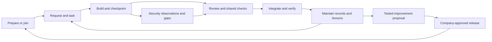

# Skilliton: development autopilot plan (v5)

Kind: Living. Canonical product direction and delivery gates. Updated 2026-09-16 after the owner aligned the parallel build sessions, and again when the owner set the Phase 3 direction (section 7; docs/PHASE-3.md). Sections 4, 6 and 7 were reconciled with the filed evidence on 2026-09-23. **v5, 2026-09-26:** the owner decided that Skilliton becomes private (decision 2026-09-26-skilliton-becomes-a-private-repository-ebc3), that the fleet is every company computer harnessed the same way through device management (2026-09-26-the-fleet-is-every-company-computer-harn-e1d4), and that compliance engagements run inside Skilliton for any framework (2026-09-26-compliance-engagements-run-inside-skilli-cbe3); section 0 gains the company's goal, section 7 gains Phase 4 and its order, and section 9 is rewritten to match.

v5 changes v4's scope where section 9 says so and adds Phase 4; everything else in v4 stands. v4 superseded v3's product scope and day-by-day ordering. Earlier plans remain in Git history. Existing evidence and unresolved checks remain valid at their recorded scope; a new plan does not close them. There is one roadmap here. Original prototype plans are archived under docs/archive/autopilot-foundation/ as implementation history, not competing instructions. All source material is indexed in docs/README.md; the saved execution objective is docs/archive/BUILD_GOAL.md.

## 0. The product

**Skilliton is a forkable development autopilot for individuals and teams using AI coding tools.** It prepares a repository with a shared way of working, helps people build from plain-language requests, preserves project knowledge, keeps security evidence current, and delivers tested improvements through company-approved updates.

The product should let a person concentrate on the requested outcome without remembering which skill to run, which document to update, or how to organize parallel branches. Skills supply judgment and guidance; commands manage durable state; supported client events trigger routine work; trusted repository checks govern shared changes. Each layer must be demonstrated before it is described as automatic.

The value beyond a native coding assistant is the team's durable, versioned operating arrangement: project records, consistent procedures, explicit checks, reviewable evidence, and a tested update path across sessions and people. The assistant's improving coding ability helps this system. Generic reminders to test are not its differentiator.

**The company's goal (v5, 2026-09-26).** Every computer the company runs, and every developer on one, is harnessed the same way: the same signed release of the same skills, rules, guard and gate, delivered through the company's device management. Uniformity is what makes the rest dependable: compliance stays accurate and current, conflicts between people and machines are found and resolved sooner, security and tasks are done well, and token use and cost go the right way, each measured before it is claimed. A compliance engagement starts from a sentence ("I need to do a SOC 2 audit") and ends in a packet an auditor can take, and Skilliton never says the company is compliant; only the auditor does.

## 1. The everyday experience

1. **Prepare or join.** A new project gets the agreed records, configuration, tool instructions, and security baseline. An existing project is adopted without resetting its history. A new teammate joins that arrangement; they do not bootstrap a competing copy.
2. **Describe work.** Turn the request into a task with acceptance criteria. Use a single branch for simple work and isolated worktrees when independent tasks justify them. The workflow handles setup and explains what matters in ordinary language.
3. **Build and checkpoint.** Record decisions, findings, test evidence, and next steps when they occur. Routine checkpoints should not depend on the person remembering a slash command.
4. **Review and integrate.** Present changed behavior, actual checks, security gaps, and unresolved decisions. Trusted application checks and the team's review policy govern merging. Keep local completion, merged, deployed, and verified states separate.
5. **Resume and improve.** A new session reconstructs the task from current records. An earned lesson becomes a proposed workflow improvement, with a regression scenario, review, and release. It does not silently rewrite company policy.

## 2. One system, with distinct responsibilities

| Component | Owns | Does not establish by itself |
|---|---|---|
| Company distribution | Approved plugin/runtime versions, installation, update and verification | Application correctness or company compliance |
| Prepare and onboarding | Adopted document paths, initial records, configuration and client adapters | That the project has already been assessed |
| Workflow skills | Task interpretation, dispatch, maintenance, handoff, plain-language review | Guaranteed execution or authenticated approval |
| Project records | Status, backlog and archive, roadmap, decisions, lessons, handoffs and task history | A passing test simply because a document says so |
| Security evidence | Scoped control mappings, observations, freshness, gaps and supporting artifacts | Complete coverage, certification, or permission to conduct testing |
| Local guardrails | Specific risky assistant actions within a supported enabled client path | Enforcement over every terminal, IDE, script or contributor |
| Shared delivery checks | Required application validation and review at the repository/release boundary | That untested requirements are satisfied |

Maintain the `scripts/skilliton.mjs` entry point (formerly Skillgate's `scripts/skillgate.mjs`, renamed in M9) and the base plugins. Integrate the preparation/security foundation through those contracts. Do not build a second onboarding stack or a second independently managed instruction block.

## 3. Project knowledge is part of installation

The default prepared project includes status, backlog and completed archive, roadmap, decisions, lessons, handoff and archive, and a repository maintenance checklist. Task, decision and lesson entries can live in separate files to support concurrent writers; readable indexes and future boards derive from those records.

Existing conventions take precedence through a validated artifact map. Create missing structures with an unassessed state, not invented priorities or completion claims. Prepare provisions the agreed structure. Maintain reconciles it against the conversation, Git state and actual evidence. Preserve established content, filenames and unrelated settings.

Workers own only the task records and proposed decision/lesson entries assigned to their lane. The integrating session owns shared indexes, status and backlog reconciliation. Default protection of `docs/` must gain explicit per-task exceptions before workers write there. Two workers never allocate the same sequential ID or treat a shared handoff as their only record.

Start with repository-local policy and existing reviewer/ownership configuration when available. Unknown ownership stays visible. An organization-wide identity directory is not a prerequisite for useful solo or small-team operation.

## 4. Security is continuous project work

Keep two evidence types separate:

- **Skill evaluation evidence:** whether a packaged skill behaved as intended in specified evaluation cases. Existing `scripts/evidence.mjs` writes this under `evidence/<commit>/`.
- **Project security evidence:** what was assessed in a project, the mapped practice, actual supporting sources/artifacts, unresolved gaps, and whether the observation is still current. Implemented as `skilliton security` in the workflow plugin's runtime (`lib/security.mjs`, `lib/security-io.mjs`, `lib/collectors.mjs`); `skilliton maintain --apply` writes its findings block into the backlog.

Use versioned framework references and explicit applicability decisions. The catalog `skillgate-baseline-2` has fifteen original practice summaries related to NIST SSDF 1.1 and OWASP ASVS 5.0.0. That is a starter baseline, not a whole-framework assessment. Broader OWASP, ISO and assessment guidance belong in reviewed catalog expansions, with permission for any restricted material and preserved attribution.

Compliance frameworks are a layer that reads these records, never a second evidence store (section 9 names the boundary). The workflow plugin ships seven public-domain libraries and the NIST CSF 2.0 spine as JSON under `frameworks/` (hipaa-security-rule, hipaa-privacy-breach, part2-overlay, ftc-safeguards, ny-dfs-500, health-wellness, legal-safeguarding), converted from MojoComply's YAML with the converter kept beside them and their sources in docs/security-catalog-sources.md. `skilliton compliance scope` proposes which frameworks the project's own files point at and records the scope only with a named person; `skilliton compliance sheet` writes the control record by walking each library's crosswalk to CSF 2.0 and the baseline crosswalk to the fifteen controls' records. A row is evidenced, partial, not started or not applicable; never compliant, certified or passed, and a test refuses those words (docs/CONTRACTS.md section 19).

The target normal-work loop identifies relevant changed areas, gathers available evidence, requests judgment where needed, records new observations, and links unresolved findings to backlog items. Report missing, stale, invalid and needs-human states. Merely regenerating a report must never renew an assessment date.

Initial prototype freshness covers explicitly named files and control/catalog definitions. Collectors (tests, secrets and the delivery policy), expiry and approved applicability are implemented since (section 6); dependency coverage, environment identity and external evidence access are further work. Never equate a current observation with a security pass. Test/scan results remain scoped evidence, not an automatic certification.

Assessment preparation may assemble authorized targets, methods, exclusions, stop conditions and evidence handling. Active penetration testing requires its own authorization and scope.

## 5. How improvements and updates flow

There are three different changes to distribute:

| Change | Target mechanism | Protection |
|---|---|---|
| Skills, hooks, executable helpers and framework packages | Tested, versioned company release through the supported distribution adapter | Exact approved version and content verification; staged rehearsal; rollback |
| Repository configuration, generated instruction blocks and record schemas | Explicit versioned migration coordinated by onboarding/update | Preview, backup, preserve project content, detect conflicts, record migration and recovery |
| Application behavior | Ordinary task branch, review and application delivery pipeline | Project-specific required checks and approval policy |

An upstream improvement is a proposal to a company fork. The company reviews and releases the version it wants its developers to receive. Once approved, updates should arrive without each developer manually copying skills. Native plugin updating is a delivery mechanism; it is not company approval, and it does not itself migrate arbitrary project files.

The executable security runtime should be owned by the approved distribution package, while each repository owns its durable observations and configuration. The copied runtime in the prototype is an integration staging design. Migrate it deliberately; do not silently overwrite differing copies or assume marketplace updates reach it. Codex and Claude adapters must select the same declared package version, or visibly report that they cannot.

Only `skilliton harness` owns the final managed instruction block. Updating a template takes effect when that writer or its future tested migration runs. Project history is never replaced by a new template. Proposed generic lessons must be stripped of source-specific details, tested, reviewed, and released before changing company defaults.

Withdrawal prevents future approval/distribution according to policy; it must not be described as disabling already installed code without proof of that mechanism.

## 6. Current implementation and evidence

Naming: the product is Skilliton (formerly Skillgate). Milestone M9 renamed every current technical name (workflow 0.6.0, guardrails 0.3.0, context-hygiene 0.2.0, project layout 3); docs/BRANDING.md says what kept its earlier name and how earlier setups move. Rehearsal results below that name earlier versions were recorded under the earlier names.

Updated 2026-09-21 at the end of wave 8, the last build wave (workflow 0.15.0, guardrails 0.5.1, context-hygiene 0.3.0, code-quality 0.2.0, read from each plugin.json on that date). The rows below were last reconciled against the tree on that date, except that the lifecycle hooks, project security evidence, delivery gate and Codex rows were brought up to date with the filed evidence on 2026-09-23. The test counts in every row are as of 2026-09-21. On 2026-09-23 each plugin.json on `main` reads workflow 0.22.0, guardrails 0.8.0, context-hygiene 0.3.1 and code-quality 0.2.1. The last signed release is 1.0.0 (2026-09-22); what `main` holds since then is in the next release, which is not signed yet. "Local" means committed on this machine's `main`; PUBLISHED, INSTALLED and VERIFIED states are named in docs/HANDOFF.md.

| Capability | Current state | Evidence or remaining proof |
|---|---|---|
| Runtime and CLI (`doctor`, `harness`, `company`, `new-plugin`, `join`, `project-settings`, `new-skill`, `import`, `prepare`, `migrate`, `remove`, `status`, `task`, `checkpoint`, `record`, `index`, `security`, `hook`, `propose`, `release`, `verify`, `trust`, `delivery`, `audit`, `usage`, `pin`) | Implemented inside the workflow plugin; one config contract; exit codes 0, 1, 2, 3 | CLI 181 checks; prepare, migrate and records 44; lifecycle 32; security 52; release 21; delivery 10; demo; project rehearsal 9 of 9 |
| Workflow skills (`task`, `dispatch`, `review`, `handoff`, `maintain`, `security`, `release`) | Implemented; instructed behavior | Evals: the review and handoff cases at 0.3.0, 4 of 4, score 1.00, mean difference 0.55 over no plugin (evidence/325d38f.../SUMMARY.md); the task and security cases at 0.3.3, score 1.00 each, difference 0.39 with the sonnet judge and 0.33 (evidence/e87d2d1.../). In eval runs the command is not on the shell path, and the skills fall back to the plugin's own `bin/` launcher (measured before the M9 rename) |
| Lifecycle hooks (session start, stop reminder, pre-compact, session end) | Implemented | Measured in real headless Claude Code sessions (evidence/rehearsals/2026-09-16-live-clients) and in an interactive session of the VS Code extension, where the session start, the guard and the stop reminder fired (evidence/live/2026-09-22-vs-code-extension-hooks.md); in a real Codex 0.156.0 session no Skilliton hook ran (evidence/live/2026-09-22-codex-session.md) |
| Guardrails | Implemented; asks in Claude Code, refuses in Codex | 487 checks; live denials (force-push; `git reset --hard` with a control) |
| Project security evidence | Implemented: applicability, expiry, collectors, findings, 15-control catalog | 52 tests; stale evidence in the project rehearsal and the demo. This repository's own register: the owner decided all 15 controls (13 apply, 2 do not, `.skilliton/security/applicability.json`); 0 of the 13 have a recorded observation (docs/SECURITY_PROPOSAL.md) |
| Making a fork the company's own (`company init`, `new-plugin`) | Implemented | Fork rehearsal 7 of 7: a renamed marketplace with a company plugin passes strict validation, releases, and installs and verifies on Claude Code 2.1.273 and Codex 0.154.0-alpha.6.2 (evidence/rehearsals/2026-09-16-fork); local-folder marketplace only |
| Machine setup (`join`, `join --undo`) | Implemented | Machine rehearsal 8 of 8 on Claude Code 2.1.273 and Codex 0.154.0-alpha.6.2 (evidence/rehearsals/2026-09-17-machine): preview writes nothing, both clients VERIFIED, verify without `--source`, a repeat changes nothing, undo keeps what was there before, refusals before any change, and installs from this repository's GitHub source; 36 tests with stand-in clients, including a regression for each finding of the security-first review |
| Renaming to Skilliton (M9) | Implemented: every current name is Skilliton; migration `0003-skilliton-names` (layout 3); earlier state named, never read as trust; guardrails and the delivery gate keep enforcing earlier settings and policy until a project moves | rename 12 tests (one skipped on macOS: case-only names), delivery 12, migrate 14; names check with self-test; rehearsals above; docs/BRANDING.md and docs/CONTRACTS.md section 16 |
| Guides stay true to the command line | `scripts/docs.test.mjs` checks every `skilliton` command, verb and relative link in README.md, docs/HOW-IT-WORKS.md, docs/ONBOARDING.md and docs/RELEASING.md, and every doc's Kind label | Self-test proves each check can fail; it does not prove a named command succeeds, which the rehearsals do |
| Releases, trust, verify, proposals, template migrations | Implemented | Company release rehearsal 18 of 18 on clean Claude Code and Codex installs, with a behavior eval that fails before the improvement and passes after |
| Delivery gate | Implemented locally (server-side pre-receive); GitHub adapter rehearsed once on a hosted repository; since 2026-09-20 it also audits the files a push changes and **rejects** a finding, which a signed policy can turn off | 12 tests with real pushes, two of them a planted flaw rejected by name and the same line accepted once it carries an allow marker; the demo rejects a defective combined change; on a throwaway hosted repository with a ruleset, a direct push was refused and a defective pull request's merge was blocked (evidence/live/2026-09-21-hosted-delivery-gate.md), while a clean change merging and the merge queue were not run |
| Self-running audit (M10) | Implemented: six rules over three catalog controls, pure over the files it is handed, run from the Stop routine, an installable `.git/hooks/pre-push` and the merge gate, with findings recordable as scoped security observations | `scripts/audit.test.mjs` with `--self-test`, each planted flaw asserted at its exact line, the same files in a different order giving the same sorted findings, and the matched text never printed. Measured 2026-09-21 on this repository: 0 findings over the 47 files wave 7 changed, 41 over every file it has ever changed, all of them a rule's own pattern or a planted fixture (B45). No external scanner integration and no `security-audit` skill yet |
| Codex | Marketplace, install, skills, `AGENTS.md` and verify measured; guardrails adapted | Plugin hooks are reported as removed in the measured Codex; in a real signed-in Codex 0.156.0 session in a prepared repository no Skilliton hook ran, though that version read the plugin's hooks file (evidence/live/2026-09-22-codex-session.md); whether a hook a person has trusted runs there is not verified |
| Usage measurement | Optional supporting module, wrapped by `skilliton usage` since 2026-09-20 (workflow 0.14.0), which groups the meter's output into one row per merged batch and prints the reconstruction note on every row; reproduces its reference window (1919 and 439 requests, both figures) on the machine that holds those transcripts | DECISIONS.md O2 closed 2026-09-18 with the two mechanisms; O3 open; `scripts/token-cost.test.mjs --reference`; no savings claim until cross-checked against the client's usage screen (M14) |
| Session cost (token efficiency) | Implemented: the context-hygiene read guard refuses a whole-file read of a non-image file over 50KB (a plugin hook, enforced on Claude Code); the harness template's Session cost section reaches every prepared project by migration; `skilliton gate` returns a project's checks as a verdict with the output in a log; the team settings template sets `autoCompactWindow` | Read guard 16 tests with the field names the tools reference documents; gate 13 tests; this repository migrated to the new template; a live refusal of a Read (rehearsal L5) and an automatic compaction at a project's window (rehearsal L6, at 100000, not the template's 600000) were measured on 2.1.276 on 2026-09-18 (docs/CLIENTS.md) |
| Pinned installs (`pin`) | Implemented 2026-09-21 (workflow 0.15.0): a skills clone moves between signed release tags, following the tag object's commit rather than the ref, with the record in `<git dir>/skilliton-pin.json`; `join` pins before it writes | `scripts/release.test.mjs` covers the move up, down and to `--latest`, and thirteen refusals, each with the clone left where it was. Not pinnable: a client's own plugin download, because neither client's marketplace command takes a ref (measured 2026-09-21 on 2.1.276); `verify` reports the mismatch instead |
| Code-quality pack (`code-quality`) | One skill shipped, three measured and not shipped, 2026-09-21 | Four skills, one eval case each, three runs per arm on commit `1242dcb`: `split-a-file` 1.00 against 0.89, a difference of 0.11, and ships; the dead-code, naming and test-strength cases scored the same in both arms and those skills are recorded in docs/not-shipped.md with their text kept beside the pack |

The evaluation scores apply to the named cases and runs only. They are not a general code-quality score or proof of production defect reduction. Writing a correct, current handoff and following the instructions remain instructed behavior even where a hook reminds or displays.

CI runs every offline suite, strict plugin validation, the demo and the offline project rehearsal. It does not run paid evaluations or live client sessions, and its private name scan can be unavailable while the run stays green with a warning. Release evidence must state those omissions.

## 7. Delivery gates and order

The original September 16-23 demonstration window does not promise completion of the expanded autopilot. Record changed scope and measured results rather than declaring a calendar day complete as a substitute for proof.

The milestones fall into three phases: **Phase 1, foundation** (M0 to M5); **Phase 2, make it yours** (M6 and M7); **Phase 3, company-wide autopilot** (M8 to M14): one name, routines that run as people work, a security audit, enrollment through a company's device management, any AI coding tool, and proof of value. [docs/PHASE-3.md](docs/PHASE-3.md) explains Phase 3 with the device-management mapping, the order, the belief check, what it will not do and its kill criteria. The owner set that direction on 2026-09-16.

| ID | Milestone | Acceptance | State |
|---|---|---|---|
| M0 | Shared direction | README, plan, contracts, instructions and handoff agree on implemented/prototype/target boundaries | Done (aligned again after integration) |
| M1 | One prepared repository | Integrate foundation through existing CLI; one instruction writer; doctor understands config; preserves existing docs; repeat/undo or recovery exercised; no unexplained status codes | **Verified locally.** docs/archive/AUTOPILOT_INTEGRATION.md I1 to I6 |
| M2 | Normal-work continuity | Actual session start/checkpoint/review/handoff integration; two contributors resume without overwriting records; missing/stale state stays visible | **Verified on Claude Code** (live sessions, headless and in the VS Code extension, evidence/live/2026-09-22-vs-code-extension-hooks.md; project rehearsal). Open: Codex lifecycle hooks (O9) |
| M3 | Approved company updates | Rehearsal fork, versioned release/verify, second clean environment joins, receives one improved skill and one safe repo migration; tampering detected; rollback and removal proved | **Verified at install level** (18 of 18, Claude Code and Codex). Open: a model session in the clean configuration and automatic updates at session start (O8) |
| M4 | Security and shared delivery | Broader applicable controls, evidence collectors and deduplicated gaps; actual application checks block a defective combined change; policy changes receive separate review | **Verified locally and on a hosted repository.** The GitHub adapter ran on a throwaway hosted repository on 2026-09-21: a direct push refused, a defective pull request's merge blocked (evidence/live/2026-09-21-hosted-delivery-gate.md). Not run there: a clean change merging, the merge queue, and a change to the policy path |
| M5 | Beginner/team rehearsal | A new builder follows the docs to prepare, build, review, resume, receive an update and recover; measure interventions, reviewer effort and missed requirements | **Not started: needs a real person** (O16); protocol ready in docs/rehearsals/NEW_BUILDER.md |
| M6 | Make it yours | A fork gives itself its own marketplace name, owner and team settings in one command, creates a company plugin and skill, passes strict validation, releases, and installs and verifies under its own name on Claude Code and Codex; docs/HOW-IT-WORKS.md explains the whole path with diagrams, and its commands and links are checked | **Verified locally** (fork rehearsal 7 of 7, evidence/rehearsals/2026-09-16-fork; `scripts/docs.test.mjs`). Installing from a GitHub source was measured in the M7 rehearsal |
| M7 | One command per machine | One previewable, undoable command takes a clean machine to VERIFIED: adds the company marketplace, installs its plugins, records the release signers from a file given out of band, keeps a source for verify, and puts `skilliton` on the terminal path, on Claude Code and Codex; installing from a GitHub source is measured | **Verified locally** (machine rehearsal 8 of 8, evidence/rehearsals/2026-09-17-machine; `scripts/join.test.mjs`). Measured since: install, a real update and verify from a private GitHub repository holding signed release tags (evidence/live/2026-09-21-private-repository.md), and this repository's own GitHub source holds the signed tags 0.9.0 and 1.0.0, which a fresh clone reads as approved (evidence/live/2026-09-22-release-1.0.0.md). Not measured: Codex against a private repository |
| M8 | Autopilot on arrival | In a repository never prepared, the session start offers preparation in plain words, previews it, applies it on a yes and starts the first task; a delivery policy is drafted from the project's detected test commands for a person to confirm; rehearsed on three repositories of different kinds and in one live Claude Code session | **Second increment built 2026-09-19** (workflow 0.10.0): the session-start offer names the order preview, apply, first task; `prepare --apply` prints the plan before writing and drafts `dispatch.laneTestCommand`, `laneRoot` and `hotspots` from the repository, plus a delivery policy draft in `.skilliton/delivery.draft.json` that no gate runs until `skilliton delivery confirm --apply` moves it; `task start --request` takes the user's words; rehearsed on a node, a python and a go repository (`evidence/rehearsals/2026-09-19-projects/`). Measured live since: a headless Claude Code session in a repository never prepared, where the hooks ran and the context carried the offer (evidence/live/2026-09-22-unprepared-repo-session-start.md), and, since workflow 0.18.0, a joined machine preparing such a repository at its first session start (evidence/live/2026-09-22-auto-prepare-live.md). Not measured: whether the assistant tells a person about the offer in its own words (docs/OWNER_WALKTHROUGH.md step 6). Codex parity depends on B2 |
| M9 | One name | Every current technical name is Skilliton (command, marketplace, `.skilliton/`, `SKILLITON_*`, instruction markers, receipt schema, release tags, machine folders); prepared projects and joined machines move by a previewable, reversible migration; only the migration reads old names; recorded evidence keeps its names; a test fails on an old name outside an allowlist; fork, machine and company release rehearsals pass again on Claude Code and Codex | **Verified locally** on 5a67e74: fork rehearsal 7 of 7, company release 18 of 18 and project rehearsal 9 of 9 under the new names on Claude Code 2.1.273 and Codex 0.154.0-alpha.6.2 (evidence/rehearsals/2026-09-17-fork, -company-release, -projects); machine rehearsal J1 to J7; `scripts/rename.test.mjs` against the real earlier release; delivery tests for a policy at the earlier path and a merge attack; an independent security-first review's 13 findings fixed. This repository migrated itself. Published as 5a67e74 and 1b626d1 (CI 35176795761, 34 of 34); machine rehearsal 8 of 8 including the GitHub install at 1b626d1 (evidence/rehearsals/2026-09-17-machine-run-2). Machines joined with the earlier release are refused, not moved (decision a319) |
| M10 | Security audit that runs itself | A deterministic offline audit of changed files runs in a Claude Code routine, a git pre-push hook and the merge gate; findings become scoped security observations linked to backlog items; known scanners run only when installed; a `security-audit` skill adds a recorded threat review; evals on a synthetic repository with planted flaws and clean look-alikes count found, missed and false alarms with and without the skill; never a "secure" verdict | **Three of its six parts built 2026-09-20** (workflow 0.14.0, commit f1a878a): the deterministic audit of changed files running in the Stop routine, an installable pre-push hook and the merge gate, which is the one that refuses; findings recordable as scoped observations whose sources are exactly the files read, so the register stales them when one changes; and no "secure" verdict anywhere. Open: known scanners run only when installed, the `security-audit` skill with its recorded threat review, and the eval half, which moved to B17 and wave 8. Measured 2026-09-21: 0 findings over the 47 files the wave changed, 41 over the whole tree, every one a rule's own pattern or a planted fixture (B45). Anthropic's `security-guidance` plugin covers in-session review on Claude Code (documented) and is enabled, not rebuilt |
| M11 | Routines while working | Beyond M8: a dispatch suggestion for prompts with six or more items, a checkpoint snapshot before compaction shown again after it, a maintain suggestion after merges or at the end of a day, each ending with the next command and switchable per project; each observed in a live headless Claude Code session and stated as instructed in tools without hooks; no cost statement before M14 | **Two of three routines built 2026-09-20** (workflow 0.13.0; decision 2026-09-20-the-client-event-behind-each-of-the-thre-f6c2): the dispatch suggestion is a UserPromptSubmit hook and the maintain suggestion is one more rule in the Stop hook, each with fixture tests and mutation checks, and each ends with the command to run. The compaction pair is wired and **observed in a live headless session** (rehearsal L6, 2026-09-18): PreCompact with trigger auto, then SessionStart with source compact carrying the Project state, and the model went on reading. Both new routines were seen in live headless sessions on 2026-09-22 (evidence/live/2026-09-22-dispatch-automation-live.md, evidence/live/2026-09-22-maintain-automation-live.md); the dispatch note fires since workflow 0.20.0, which reads the field the client actually sends, and it was not run in the interactive extension. Open (B21): the checkpoint snapshot written *before* compaction, which PreCompact today only records an event for, and a per-project switch for the dispatch suggestion, which has a threshold and no on or off |
| M12 | Enrollment through device management | A company profile and a signed release produce an enrollment bundle (Claude Code managed settings drop-in, macOS profile and Windows registry forms, other tools' managed configuration, release signers, first-login setup, a detection script reporting the verify result, offboarding, release rings); on clean machines with files placed as device management places them, first login ends VERIFIED with no developer command, tampering is reported, offboarding leaves nothing, and a pinned ring does not follow a newer release. The bundle works alongside a company's endpoint security: an IT allow list, kept matched to the code, names every program, folder, network destination and privilege Skilliton needs; a preflight check names what a policy blocks before setup changes anything; Skilliton stays user-level with no downloaded executables and no web requests of its own; and a first login ends VERIFIED under a real endpoint-security policy. Windows is decided and supported or stated as unsupported, and install, update and verify work from a private company repository | **Spike measured on Linux** (B22): a managed drop-in installs the company plugins with no developer command, active from the third session start from GitHub; a first-login install before the first session makes the first start active (evidence/rehearsals/2026-09-17-enrollment, 8 of 8, Claude Code 2.1.274, no login; decision 2026-09-17-enrollment-installs-claude-code-plugins-9cf3). The bundle is not built. Endpoint security is built and, where it can be, proved: docs/IT-ALLOWLIST.md is held to the code by `scripts/allowlist.test.mjs`, the small footprint by `scripts/footprint.test.mjs`, and `skilliton preflight` checks a laptop before setup and is proved against blocks made on purpose (`scripts/preflight.test.mjs`), with **no endpoint-security product available to test under** (B29). Windows is decided: Git for Windows, one implementation of every hook, built 2026-09-17, and measured on a GitHub-hosted Windows runner on 2026-09-22 and again after the port on 2026-09-23, where preflight, preparation, status, every session hook and the guard's decisions pass with no Claude Code session, since the runner has no login (evidence/live/windows/2026-09-23-hosted-runner-port.md). Windows is **not supported**: a command of several hundred KB takes the guard longer than its timeout (B80), and no Claude Code session has run on a Windows machine (B30); a program in the project folder no longer stands in for one Skilliton starts by a bare name (B79, closed 2026-09-23). The clean macOS account half needs a separate Mac or a macOS virtual machine; a real Intune or Jamf tenant needs the owner's access |
| M13 | Any AI coding tool | The portable core (skills, instruction block, git hooks, merge gate, command) plus an adapter per tool; a tool is called supported only when its CLIENTS.md column is measured (skills visible, instructions read, each hook observed, verify reads the install) and a rehearsal passes | **Not started** (B23). Claude Code and Codex are measured, and Claude Code's VS Code extension has its own measured column as of 2026-09-20, measured again on 2026-09-22 in a session whose plugins were loaded at its start. VS Code with GitHub Copilot and Grok Build document reading Claude Code's plugin and hook files. Cursor, the owner's chosen second tool (O24), now has its own **documented, never measured** column as of 2026-09-20, read from published documentation with retrieval dates and a decision entry naming what an adapter would have to write; no session has run there, so no row of it says measured (B23) |
| M14 | Proof of value and team view | The same real tasks with the plain tool and with Skilliton: tokens and cost from `scripts/token-cost.mjs` cross-checked against the client's usage metrics, time, interventions, rework, planted flaws caught before merge, resume accuracy; a locally generated read-only team view; time, cost and quality statements only from these numbers | **Started: first comparison run 2026-09-22** under docs/COMPARISON_PROTOCOL.md (evidence/comparison/2026-09-22/SUMMARY.md). Left: the cross-check against the client's Usage screen (B16) and the team view (B15). No time, cost or quality statement is made from the first run |

### Phase 4 (v5, 2026-09-26): one harness on every company computer

| ID | Milestone | Acceptance | State |
|---|---|---|---|
| M15 | Private and quiet | The repository is private and ruleset 23792740 is proved to apply there (`gh api repos/<owner>/<repo>/rules/branches/main` lists its three rules); `pin` keeps a project's installs when it moves the marketplace (B102); the interruption fixes B94, B95, B96, B97 and B99; every prompt and reminder a session produces is counted (B100) and a release may not raise the count over a ceiling the owner sets | **Not started.** Visibility is the owner's step; on 2026-09-26 the owner chose to stay public for now. Batch planned for 2026-09-27 (LANES.md): B102, B95, B94, B96, B97, B99, B100 and the ceiling |
| M16 | Compliance engagements | A spoken or typed request records an engagement (framework, product, who asked, when); the named person confirms scope, including the intake questions (B98); every control of the framework is evaluated against the code and the evidence; evidence types map to the command or the person that supplies them (B101); evidence a repository already produces is read in (B72); collection with a person (screenshots of admin consoles, attestations) is prototyped, then built; an auditor packet (index, a sheet per control, the evidence) is assembled; SOC 2 and PCI DSS libraries are converted into the private repository under their terms; measured end to end on one company product; no output says compliant, certified or passing | **First increment shipped in 1.5.0** (detection, confirmation, the control sheet, seven public libraries). B98 and B101 are in the 2026-09-27 batch; the SOC 2 and PCI DSS libraries wait for the repository to be private |
| M17 | Any framework | Each further framework arrives as a library plus a crosswalk to NIST CSF 2.0 and nothing else: NIST SP 800-53 and others in the public domain as needed; HITRUST CSF and ISO 27001 only under their publishers' licences | Not started |
| M18 | Always-on agents | Machines take work from GitHub issues by assigning an issue to themselves, each in its own lane and worktree, and deliver only through the merge gate; daily budgets per product and per machine, one command that stops them all, one daily digest (what merged, what it cost, what failed, what needs a person) in place of prompts; a new release reaches one machine, then the fleet, then laptops, and rolls back when verify or the prompt count gets worse; a proposed improvement lands only as an evaluated, signed release | Not started; after M12 |

**Order from here:** M15, then M12 (Phase 3's enrollment milestone, first because the goal is every computer harnessed: with Intune named by the owner, a clean Mac and a Windows PC enrolled in a real tenant end VERIFIED at first login with no developer command; the GitHub read credential a private repository needs is decided and placed; release rings are device-management groups; a detection script reports verify's result to device management; offboarding leaves nothing; the Linux half is measured, B22, and the machines and tenant are the owner's, B29 and B30), then M16, with M14's measurement running beside them (the meter as the default in company repositories, batches counted when merges fast-forward, the Usage screen cross-check; Claude Code keeps transcripts for 30 days, so a baseline not captured by mid-October 2026 is gone), then M17 and M18. Owner-only steps, gathered in one session: the visibility change, a clean Mac and a Windows PC in the tenant, the Intune tenant itself, the Usage screen reading, a named scope on one company product.

The integration steps and their evidence are in [docs/archive/AUTOPILOT_INTEGRATION.md](docs/archive/AUTOPILOT_INTEGRATION.md). Contracts are in [docs/CONTRACTS.md](docs/CONTRACTS.md). The latest execution state is [docs/HANDOFF.md](docs/HANDOFF.md). No milestone with an open item above is complete.

## 8. Quality, review and trust

Use meaningful passing and failing cases, then observe the actual lifecycle on supported clients. A package test is not a clean-machine install. A local green branch is not proof about the latest combined merge result. A generated document is not evidence that a check ran.

Authorized local work proceeds within task scope; repository policy determines human review and approval at merge and release. Reduce routine review effort through better requirements, smaller changes, relevant automated checks and clear evidence packages. Narrower faster paths may follow measured results; do not promise that a lead developer can stop reviewing consequential changes.

Retain the original security-review cases in the release rehearsal: a malicious hook hidden behind passing evals; ref drift versus exact approved content; escaping import/manifest paths; unauthorized release attempt; withdrawn but installed code; a bad update reaching another environment; private material in a skill import; local guardrail bypass limits. Use disposable environments and synthetic data. This is a scoped review of Skilliton and its delivery path, not independent certification or testing of third-party systems. Which of these cases, platforms, versions and setups have actually been exercised is tracked in docs/COVERAGE.md.

Track outcomes against native-tool workflows: requirement completion, restart accuracy, interventions, integration repairs, reviewer time and repeat mistakes. Cost remains one supporting measure. The unresolved historical meter reproduction does not block repository preparation, updates or security integration; it blocks the associated cost claim.

## 9. Scope boundaries

First deliver a local-first, Git-backed system that a solo builder or small team can use. Reuse repository-host checks and native distribution where proven. Defer a hosted dashboard, universal device-management enforcement and an organization-wide identity service. Compliance is in scope as engagements over the security evidence of section 4 (decision 2026-09-26-compliance-engagements-run-inside-skilli-cbe3, superseding the narrower scope of 2026-09-25-compliance-lives-in-public-skilliton-as-39ef): framework libraries as data, any framework that has a library and a crosswalk to NIST CSF 2.0, a scope and an engagement a named person confirms, evidence gathered from the repository and, with a person, from outside it (screenshots, attestations), and an auditor packet, in the states evidenced, partial, not started and not applicable. Licensed framework text lives only in this private repository and only under its publisher's terms. Declined, not deferred: any attestation or certification, any output saying a company is compliant, certified or passing, deciding for an organization that a framework applies to it, and regulated data of any kind inside this tool. Phase 3 builds enrollment bundles that a company's own device management delivers (M12, first in Phase 4's order); running device management or identity remains out of scope. Live multiplayer sessions, where a team watches and steers one agent session together, are a separate companion project with its own repository, where its idea and open questions are kept; no milestone here depends on it.

Company device onboarding can install prerequisites and the approved tools; it cannot prove repository controls or application behavior by itself. Keep project rules in the repository and organizational authority with the company. No private client content, credential values or personal material goes into this repository, private or not.

Official platform behavior is verified per feature when implemented or changed. See the current platform documentation instead of carrying an untested list of capabilities forward from an older plan: https://code.claude.com/docs/en/plugin-marketplaces and https://developers.openai.com/codex/skills/ . Framework source/version research is preserved in docs/archive/autopilot-foundation/PLAN.md and must be rechecked for catalog expansion.
