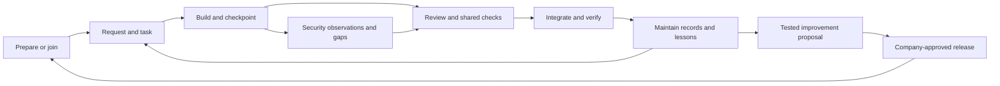

# Skillgate: development autopilot plan (v4)

Kind: Living. Canonical product direction and delivery gates. Updated 2026-09-16 after the owner aligned the parallel build sessions.

This version supersedes v3's product scope and day-by-day ordering. Earlier plans remain in Git history. Existing evidence and unresolved checks remain valid at their recorded scope; a new plan does not close them. There is one roadmap here. Original prototype plans are archived under docs/history/autopilot-foundation/ as implementation history, not competing instructions. All source material is indexed in docs/AUTOPILOT_START_HERE.md; the saved execution objective is docs/BUILD_GOAL.md.

## 0. The product

**Skillgate is a forkable development autopilot for individuals and teams using AI coding tools.** It prepares a repository with a shared way of working, helps people build from plain-language requests, preserves project knowledge, keeps security evidence current, and delivers tested improvements through company-approved updates.

The product should let a person concentrate on the requested outcome without remembering which skill to run, which document to update, or how to organize parallel branches. Skills supply judgment and guidance; commands manage durable state; supported client events trigger routine work; trusted repository checks govern shared changes. Each layer must be demonstrated before it is described as automatic.

The value beyond a native coding assistant is the team's durable, versioned operating arrangement: project records, consistent procedures, explicit checks, reviewable evidence, and a tested update path across sessions and people. The assistant's improving coding ability helps this system. Generic reminders to test are not its differentiator.

## 1. The everyday experience

1. **Prepare or join.** A new project gets the agreed records, configuration, tool instructions, and security baseline. An existing project is adopted without resetting its history. A new teammate joins that arrangement; they do not bootstrap a competing copy.
2. **Describe work.** Turn the request into a task with acceptance criteria. Use a single branch for simple work and isolated worktrees when independent tasks justify them. The workflow handles setup and explains what matters in ordinary language.
3. **Build and checkpoint.** Record decisions, findings, test evidence, and next steps when they occur. Routine checkpoints should not depend on the person remembering a slash command.
4. **Review and integrate.** Present changed behavior, actual checks, security gaps, and unresolved decisions. Trusted application checks and the team's review policy govern merging. Keep local completion, merged, deployed, and verified states separate.
5. **Resume and improve.** A new session reconstructs the task from current records. An earned lesson becomes a proposed workflow improvement, with a regression scenario, review, and release. It does not silently rewrite company policy.

## 2. One system, with distinct responsibilities

| Component | Owns | Does not establish by itself |
|---|---|---|
| Company distribution | Approved plugin/runtime versions, installation, update and verification | Application correctness or company compliance |
| Prepare and onboarding | Adopted document paths, initial records, configuration and client adapters | That the project has already been assessed |
| Workflow skills | Task interpretation, dispatch, maintenance, handoff, plain-language review | Guaranteed execution or authenticated approval |
| Project records | Status, backlog and archive, roadmap, decisions, lessons, handoffs and task history | A passing test simply because a document says so |
| Security evidence | Scoped control mappings, observations, freshness, gaps and supporting artifacts | Complete coverage, certification, or permission to conduct testing |
| Local guardrails | Specific risky assistant actions within a supported enabled client path | Enforcement over every terminal, IDE, script or contributor |
| Shared delivery checks | Required application validation and review at the repository/release boundary | That untested requirements are satisfied |

Maintain the existing `scripts/skillgate.mjs` entry point and the base plugins. Integrate the preparation/security foundation through those contracts. Do not build a second onboarding stack or a second independently managed instruction block.

## 3. Project knowledge is part of installation

The default prepared project includes status, backlog and completed archive, roadmap, decisions, lessons, handoff and archive, and a repository maintenance checklist. Task, decision and lesson entries can live in separate files to support concurrent writers; readable indexes and future boards derive from those records.

Existing conventions take precedence through a validated artifact map. Create missing structures with an unassessed state, not invented priorities or completion claims. Prepare provisions the agreed structure. Maintain reconciles it against the conversation, Git state and actual evidence. Preserve established content, filenames and unrelated settings.

Workers own only the task records and proposed decision/lesson entries assigned to their lane. The integrating session owns shared indexes, status and backlog reconciliation. Default protection of `docs/` must gain explicit per-task exceptions before workers write there. Two workers never allocate the same sequential ID or treat a shared handoff as their only record.

Start with repository-local policy and existing reviewer/ownership configuration when available. Unknown ownership stays visible. An organization-wide identity directory is not a prerequisite for useful solo or small-team operation.

## 4. Security is continuous project work

Keep two evidence types separate:

- **Skill evaluation evidence:** whether a packaged skill behaved as intended in specified evaluation cases. Existing `scripts/evidence.mjs` writes this under `evidence/<commit>/`.
- **Project security evidence:** what was assessed in a project, the mapped practice, actual supporting sources/artifacts, unresolved gaps, and whether the observation is still current. Its standalone prototype scripts are present in this checkout; the current CLI and lifecycle do not yet invoke them.

Use versioned framework references and explicit applicability decisions. The prototype has seven original practice summaries related to NIST SSDF 1.1 and OWASP ASVS 5.0.0. That is a starter baseline, not a whole-framework assessment. Broader OWASP, ISO and assessment guidance belong in reviewed catalog expansions, with permission for any restricted material and preserved attribution.

The target normal-work loop identifies relevant changed areas, gathers available evidence, requests judgment where needed, records new observations, and links unresolved findings to backlog items. Report missing, stale, invalid and needs-human states. Merely regenerating a report must never renew an assessment date.

Initial prototype freshness covers explicitly named files and control/catalog definitions. Collectors, dependency coverage, environment identity, expiry, external evidence access and approved applicability are further work. Never equate a current observation with a security pass. Test/scan results remain scoped evidence, not an automatic certification.

Assessment preparation may assemble authorized targets, methods, exclusions, stop conditions and evidence handling. Active penetration testing requires its own authorization and scope.

## 5. How improvements and updates flow

There are three different changes to distribute:

| Change | Target mechanism | Protection |
|---|---|---|
| Skills, hooks, executable helpers and framework packages | Tested, versioned company release through the supported distribution adapter | Exact approved version and content verification; staged rehearsal; rollback |
| Repository configuration, generated instruction blocks and record schemas | Explicit versioned migration coordinated by onboarding/update | Preview, backup, preserve project content, detect conflicts, record migration and recovery |
| Application behavior | Ordinary task branch, review and application delivery pipeline | Project-specific required checks and approval policy |

An upstream improvement is a proposal to a company fork. The company reviews and releases the version it wants its developers to receive. Once approved, updates should arrive without each developer manually copying skills. Native plugin updating is a delivery mechanism; it is not company approval, and it does not itself migrate arbitrary project files.

The executable security runtime should be owned by the approved distribution package, while each repository owns its durable observations and configuration. The copied runtime in the prototype is an integration staging design. Migrate it deliberately; do not silently overwrite differing copies or assume marketplace updates reach it. Codex and Claude adapters must select the same declared package version, or visibly report that they cannot.

Only `skillgate harness` owns the final managed instruction block. Updating a template takes effect when that writer or its future tested migration runs. Project history is never replaced by a new template. Proposed generic lessons must be stripped of source-specific details, tested, reviewed, and released before changing company defaults.

Withdrawal prevents future approval/distribution according to policy; it must not be described as disabling already installed code without proof of that mechanism.

## 6. Current implementation and evidence

| Capability | Current state | Evidence or remaining proof |
|---|---|---|
| Base `workflow`, `guardrails`, `context-hygiene` plugins | Implemented on main | Repository fixtures, recorded workflow evaluations and one live headless force-push probe |
| `doctor`, `harness`, `project-settings`, `new-skill`, `import` | Implemented on main | CLI tests; install/update rehearsal still open |
| Prepare and project security runtime | Standalone scripts/tests/demo imported from `23aae41` into this checkout; current CLI and lifecycle wiring still open | See evidence/autopilot-foundation/import-validation.md for local results; M1 still requires combined behavior proof |
| Ongoing event-driven checkpoints and security refresh | Instructed in parts; integrated lifecycle not proven | Exercise actual supported client events and recovery behavior |
| `release`, `verify`, approved update and tamper detection | Planned | Release schema exists; end-to-end distribution proof remains open |
| Application merge enforcement | Target capability | Package CI is not a company's application merge gate |
| Codex parity | Not rehearsed | Running this repository's development in Codex does not prove installed plugin/hook behavior |
| Usage measurement | Optional supporting module; known reproduction gap | DECISIONS.md O2 and O3; no savings claim until reproduced and cross-checked |

The recorded 0.98 skill-evaluation score and 0.51 mean uplift apply to four workflow scenarios with three runs per arm. They are not a general code-quality score or proof of production defect reduction. Handoff display is automatic when the installed hook runs; writing a correct, current handoff remains instructed. Local guardrails inspect supported Claude Bash calls and explicitly exclude several indirect command forms.

Current CI runs offline package/repository checks and plugin validation. It does not run paid model evaluations. Its private name scan can be unavailable while the run stays green with a warning. Required release evidence must state those omissions. The target policy is offline checks on every PR and scoped behavioral evidence for relevant skill changes before company release, with the evidence tied to the reviewed candidate.

## 7. Delivery gates and order

The original September 16-23 demonstration window does not promise completion of the expanded autopilot. Execute these milestones in order, with independent distribution work allowed after shared contracts are agreed. Record changed scope and measured results rather than declaring a calendar day complete as a substitute for proof.

| ID | Milestone | Acceptance | State |
|---|---|---|---|
| M0 | Shared direction | README, plan, contracts, instructions and handoff agree on implemented/prototype/target boundaries | Documentation aligned in this change |
| M1 | One prepared repository | Integrate foundation through existing CLI; one instruction writer; doctor understands config; preserves existing docs; repeat/undo or recovery exercised; no unexplained status codes | Next |
| M2 | Normal-work continuity | Actual session start/checkpoint/review/handoff integration; two contributors resume without overwriting records; missing/stale state stays visible | Planned |
| M3 | Approved company updates | Rehearsal fork, versioned release/verify, second clean environment joins, receives one improved skill and one safe repo migration; tampering detected; rollback and removal proved | Planned |
| M4 | Security and shared delivery | Broader applicable controls, evidence collectors and deduplicated gaps; actual application checks block a defective combined change; policy changes receive separate review | Planned |
| M5 | Beginner/team rehearsal | A new builder follows the docs to prepare, build, review, resume, receive an update and recover; measure interventions, reviewer effort and missed requirements | Planned |

M1 integration work and ownership are detailed in [docs/AUTOPILOT_INTEGRATION.md](docs/AUTOPILOT_INTEGRATION.md). Contracts distinguish current implementation from target decisions in [docs/CONTRACTS.md](docs/CONTRACTS.md). The latest execution state is [docs/HANDOFF.md](docs/HANDOFF.md). Do not turn the prototype branch's older plan into a second live roadmap.

## 8. Quality, review and trust

Use meaningful passing and failing cases, then observe the actual lifecycle on supported clients. A package test is not a clean-machine install. A local green branch is not proof about the latest combined merge result. A generated document is not evidence that a check ran.

Authorized local work proceeds within task scope; repository policy determines human review and approval at merge and release. Reduce routine review effort through better requirements, smaller changes, relevant automated checks and clear evidence packages. Narrower faster paths may follow measured results; do not promise that a lead developer can stop reviewing consequential changes.

Retain the original security-review cases in the release rehearsal: a malicious hook hidden behind passing evals; ref drift versus exact approved content; escaping import/manifest paths; unauthorized release attempt; withdrawn but installed code; a bad update reaching another environment; private material in a skill import; local guardrail bypass limits. Use disposable environments and synthetic data. This is a scoped review of Skillgate and its delivery path, not independent certification or testing of third-party systems.

Track outcomes against native-tool workflows: requirement completion, restart accuracy, interventions, integration repairs, reviewer time and repeat mistakes. Cost remains one supporting measure. The unresolved historical meter reproduction does not block repository preparation, updates or security integration; it blocks the associated cost claim.

## 9. Scope boundaries

First deliver a local-first, Git-backed system that a solo builder or small team can use. Reuse repository-host checks and native distribution where proven. Defer a hosted dashboard, universal device-management enforcement, an organization-wide identity service, and a broad compliance platform.

Company device onboarding can install prerequisites and the approved tools; it cannot prove repository controls or application behavior by itself. Keep project rules in the repository and organizational authority with the company. No private client content, credential values or personal material goes into this public starter.

Official platform behavior is verified per feature when implemented or changed. See the current platform documentation instead of carrying an untested list of capabilities forward from an older plan: https://code.claude.com/docs/en/plugin-marketplaces and https://developers.openai.com/codex/skills/ . Framework source/version research is preserved in docs/history/autopilot-foundation/PLAN.md and must be rechecked for catalog expansion.
