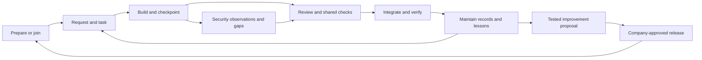

# Skilliton: development autopilot plan (v4)

Kind: Living. Canonical product direction and delivery gates. Updated 2026-09-16 after the owner aligned the parallel build sessions, and again when the owner set the Phase 3 direction (section 7; docs/PHASE-3.md).

This version supersedes v3's product scope and day-by-day ordering. Earlier plans remain in Git history. Existing evidence and unresolved checks remain valid at their recorded scope; a new plan does not close them. There is one roadmap here. Original prototype plans are archived under docs/history/autopilot-foundation/ as implementation history, not competing instructions. All source material is indexed in docs/AUTOPILOT_START_HERE.md; the saved execution objective is docs/BUILD_GOAL.md.

## 0. The product

**Skilliton is a forkable development autopilot for individuals and teams using AI coding tools.** It prepares a repository with a shared way of working, helps people build from plain-language requests, preserves project knowledge, keeps security evidence current, and delivers tested improvements through company-approved updates.

The product should let a person concentrate on the requested outcome without remembering which skill to run, which document to update, or how to organize parallel branches. Skills supply judgment and guidance; commands manage durable state; supported client events trigger routine work; trusted repository checks govern shared changes. Each layer must be demonstrated before it is described as automatic.

The value beyond a native coding assistant is the team's durable, versioned operating arrangement: project records, consistent procedures, explicit checks, reviewable evidence, and a tested update path across sessions and people. The assistant's improving coding ability helps this system. Generic reminders to test are not its differentiator.

## 1. The everyday experience

1. **Prepare or join.** A new project gets the agreed records, configuration, tool instructions, and security baseline. An existing project is adopted without resetting its history. A new teammate joins that arrangement; they do not bootstrap a competing copy.
2. **Describe work.** Turn the request into a task with acceptance criteria. Use a single branch for simple work and isolated worktrees when independent tasks justify them. The workflow handles setup and explains what matters in ordinary language.
3. **Build and checkpoint.** Record decisions, findings, test evidence, and next steps when they occur. Routine checkpoints should not depend on the person remembering a slash command.
4. **Review and integrate.** Present changed behavior, actual checks, security gaps, and unresolved decisions. Trusted application checks and the team's review policy govern merging. Keep local completion, merged, deployed, and verified states separate.
5. **Resume and improve.** A new session reconstructs the task from current records. An earned lesson becomes a proposed workflow improvement, with a regression scenario, review, and release. It does not silently rewrite company policy.

## 2. One system, with distinct responsibilities

| Component | Owns | Does not establish by itself |
|---|---|---|
| Company distribution | Approved plugin/runtime versions, installation, update and verification | Application correctness or company compliance |
| Prepare and onboarding | Adopted document paths, initial records, configuration and client adapters | That the project has already been assessed |
| Workflow skills | Task interpretation, dispatch, maintenance, handoff, plain-language review | Guaranteed execution or authenticated approval |
| Project records | Status, backlog and archive, roadmap, decisions, lessons, handoffs and task history | A passing test simply because a document says so |
| Security evidence | Scoped control mappings, observations, freshness, gaps and supporting artifacts | Complete coverage, certification, or permission to conduct testing |
| Local guardrails | Specific risky assistant actions within a supported enabled client path | Enforcement over every terminal, IDE, script or contributor |
| Shared delivery checks | Required application validation and review at the repository/release boundary | That untested requirements are satisfied |

Maintain the `scripts/skilliton.mjs` entry point (formerly Skillgate's `scripts/skillgate.mjs`, renamed in M9) and the base plugins. Integrate the preparation/security foundation through those contracts. Do not build a second onboarding stack or a second independently managed instruction block.

## 3. Project knowledge is part of installation

The default prepared project includes status, backlog and completed archive, roadmap, decisions, lessons, handoff and archive, and a repository maintenance checklist. Task, decision and lesson entries can live in separate files to support concurrent writers; readable indexes and future boards derive from those records.

Existing conventions take precedence through a validated artifact map. Create missing structures with an unassessed state, not invented priorities or completion claims. Prepare provisions the agreed structure. Maintain reconciles it against the conversation, Git state and actual evidence. Preserve established content, filenames and unrelated settings.

Workers own only the task records and proposed decision/lesson entries assigned to their lane. The integrating session owns shared indexes, status and backlog reconciliation. Default protection of `docs/` must gain explicit per-task exceptions before workers write there. Two workers never allocate the same sequential ID or treat a shared handoff as their only record.

Start with repository-local policy and existing reviewer/ownership configuration when available. Unknown ownership stays visible. An organization-wide identity directory is not a prerequisite for useful solo or small-team operation.

## 4. Security is continuous project work

Keep two evidence types separate:

- **Skill evaluation evidence:** whether a packaged skill behaved as intended in specified evaluation cases. Existing `scripts/evidence.mjs` writes this under `evidence/<commit>/`.
- **Project security evidence:** what was assessed in a project, the mapped practice, actual supporting sources/artifacts, unresolved gaps, and whether the observation is still current. Its standalone prototype scripts are present in this checkout; the current CLI and lifecycle do not yet invoke them.

Use versioned framework references and explicit applicability decisions. The prototype has seven original practice summaries related to NIST SSDF 1.1 and OWASP ASVS 5.0.0. That is a starter baseline, not a whole-framework assessment. Broader OWASP, ISO and assessment guidance belong in reviewed catalog expansions, with permission for any restricted material and preserved attribution.

The target normal-work loop identifies relevant changed areas, gathers available evidence, requests judgment where needed, records new observations, and links unresolved findings to backlog items. Report missing, stale, invalid and needs-human states. Merely regenerating a report must never renew an assessment date.

Initial prototype freshness covers explicitly named files and control/catalog definitions. Collectors, dependency coverage, environment identity, expiry, external evidence access and approved applicability are further work. Never equate a current observation with a security pass. Test/scan results remain scoped evidence, not an automatic certification.

Assessment preparation may assemble authorized targets, methods, exclusions, stop conditions and evidence handling. Active penetration testing requires its own authorization and scope.

## 5. How improvements and updates flow

There are three different changes to distribute:

| Change | Target mechanism | Protection |
|---|---|---|
| Skills, hooks, executable helpers and framework packages | Tested, versioned company release through the supported distribution adapter | Exact approved version and content verification; staged rehearsal; rollback |
| Repository configuration, generated instruction blocks and record schemas | Explicit versioned migration coordinated by onboarding/update | Preview, backup, preserve project content, detect conflicts, record migration and recovery |
| Application behavior | Ordinary task branch, review and application delivery pipeline | Project-specific required checks and approval policy |

An upstream improvement is a proposal to a company fork. The company reviews and releases the version it wants its developers to receive. Once approved, updates should arrive without each developer manually copying skills. Native plugin updating is a delivery mechanism; it is not company approval, and it does not itself migrate arbitrary project files.

The executable security runtime should be owned by the approved distribution package, while each repository owns its durable observations and configuration. The copied runtime in the prototype is an integration staging design. Migrate it deliberately; do not silently overwrite differing copies or assume marketplace updates reach it. Codex and Claude adapters must select the same declared package version, or visibly report that they cannot.

Only `skilliton harness` owns the final managed instruction block. Updating a template takes effect when that writer or its future tested migration runs. Project history is never replaced by a new template. Proposed generic lessons must be stripped of source-specific details, tested, reviewed, and released before changing company defaults.

Withdrawal prevents future approval/distribution according to policy; it must not be described as disabling already installed code without proof of that mechanism.

## 6. Current implementation and evidence

Naming: the product is Skilliton (formerly Skillgate). Milestone M9 renamed every current technical name (workflow 0.6.0, guardrails 0.3.0, context-hygiene 0.2.0, project layout 3); docs/BRANDING.md says what kept its earlier name and how earlier setups move. Rehearsal results below that name earlier versions were recorded under the earlier names.

Updated 2026-09-16 after the M1-M4 integration, the follow-ups, the task and security eval cases, the fork commands and how-it-works guide, machine setup, and the Skilliton naming (workflow 0.5.1, guardrails 0.2.0, context-hygiene 0.1.3). "Local" means committed on this machine's `main`; PUBLISHED, INSTALLED and VERIFIED states are named in docs/HANDOFF.md.

| Capability | Current state | Evidence or remaining proof |
|---|---|---|
| Runtime and CLI (`doctor`, `harness`, `company`, `new-plugin`, `join`, `project-settings`, `new-skill`, `import`, `prepare`, `migrate`, `remove`, `status`, `task`, `checkpoint`, `record`, `index`, `security`, `hook`, `propose`, `release`, `verify`, `trust`, `delivery`) | Implemented inside the workflow plugin; one config contract; exit codes 0, 1, 2, 3 | CLI 181 checks; prepare, migrate and records 44; lifecycle 32; security 52; release 21; delivery 10; demo; project rehearsal 9 of 9 |
| Workflow skills (`task`, `dispatch`, `review`, `handoff`, `maintain`, `security`) | Implemented; instructed behavior | Evals: the review and handoff cases at 0.3.0, 4 of 4, score 1.00, mean difference 0.55 over no plugin (evidence/325d38f.../SUMMARY.md); the task and security cases at 0.3.3, score 1.00 each, difference 0.39 with the sonnet judge and 0.33 (evidence/e87d2d1.../). In eval runs the command is not on the shell path, and the skills fall back to the plugin's own `bin/` launcher (measured before the M9 rename) |
| Lifecycle hooks (session start, stop reminder, pre-compact, session end) | Implemented | Measured in real headless Claude Code sessions (evidence/rehearsals/2026-09-16-live-clients); interactive sessions and Codex not observed |
| Guardrails | Implemented; asks in Claude Code, refuses in Codex | 487 checks; live denials (force-push; `git reset --hard` with a control) |
| Project security evidence | Implemented: applicability, expiry, collectors, findings, 15-control catalog | 52 tests; stale evidence in the project rehearsal and the demo |
| Making a fork the company's own (`company init`, `new-plugin`) | Implemented | Fork rehearsal 7 of 7: a renamed marketplace with a company plugin passes strict validation, releases, and installs and verifies on Claude Code 2.1.273 and Codex 0.154.0-alpha.6.2 (evidence/rehearsals/2026-09-16-fork); local-folder marketplace only |
| Machine setup (`join`, `join --undo`) | Implemented | Machine rehearsal 8 of 8 on Claude Code 2.1.273 and Codex 0.154.0-alpha.6.2 (evidence/rehearsals/2026-09-17-machine): preview writes nothing, both clients VERIFIED, verify without `--source`, a repeat changes nothing, undo keeps what was there before, refusals before any change, and installs from this repository's GitHub source; 36 tests with stand-in clients, including a regression for each finding of the security-first review |
| Renaming to Skilliton (M9) | Implemented: every current name is Skilliton; migration `0003-skilliton-names` (layout 3); earlier state named, never read as trust; guardrails and the delivery gate keep enforcing earlier settings and policy until a project moves | rename 12 tests (one skipped on macOS: case-only names), delivery 12, migrate 14; names check with self-test; rehearsals above; docs/BRANDING.md and docs/CONTRACTS.md section 16 |
| Guides stay true to the command line | `scripts/docs.test.mjs` checks every `skilliton` command, verb and relative link in README.md, docs/HOW-IT-WORKS.md, docs/ONBOARDING.md and docs/RELEASING.md, and every doc's Kind label | Self-test proves each check can fail; it does not prove a named command succeeds, which the rehearsals do |
| Releases, trust, verify, proposals, template migrations | Implemented | Company release rehearsal 18 of 18 on clean Claude Code and Codex installs, with a behavior eval that fails before the improvement and passes after |
| Delivery gate | Implemented locally (server-side pre-receive); GitHub adapter documented | 10 tests with real pushes; the demo rejects a defective combined change; hosted adapter not rehearsed |
| Codex | Marketplace, install, skills, `AGENTS.md` and verify measured; guardrails adapted | Plugin hooks are removed in the measured Codex; lifecycle hooks need a run from a logged-in isolated Codex home |
| Usage measurement | Optional supporting module; known reproduction gap | DECISIONS.md O2 and O3; no savings claim until reproduced and cross-checked |

The evaluation scores apply to the named cases and runs only. They are not a general code-quality score or proof of production defect reduction. Writing a correct, current handoff and following the instructions remain instructed behavior even where a hook reminds or displays.

CI runs every offline suite, strict plugin validation, the demo and the offline project rehearsal. It does not run paid evaluations or live client sessions, and its private name scan can be unavailable while the run stays green with a warning. Release evidence must state those omissions.

## 7. Delivery gates and order

The original September 16-23 demonstration window does not promise completion of the expanded autopilot. Record changed scope and measured results rather than declaring a calendar day complete as a substitute for proof.

The milestones fall into three phases: **Phase 1, foundation** (M0 to M5); **Phase 2, make it yours** (M6 and M7); **Phase 3, company-wide autopilot** (M8 to M14): one name, routines that run as people work, a security audit, enrollment through a company's device management, any AI coding tool, and proof of value. [docs/PHASE-3.md](docs/PHASE-3.md) explains Phase 3 with the device-management mapping, the order, the belief check, what it will not do and its kill criteria. The owner set that direction on 2026-09-16.

| ID | Milestone | Acceptance | State |
|---|---|---|---|
| M0 | Shared direction | README, plan, contracts, instructions and handoff agree on implemented/prototype/target boundaries | Done (aligned again after integration) |
| M1 | One prepared repository | Integrate foundation through existing CLI; one instruction writer; doctor understands config; preserves existing docs; repeat/undo or recovery exercised; no unexplained status codes | **Verified locally.** docs/AUTOPILOT_INTEGRATION.md I1 to I6 |
| M2 | Normal-work continuity | Actual session start/checkpoint/review/handoff integration; two contributors resume without overwriting records; missing/stale state stays visible | **Verified on Claude Code** (live sessions; project rehearsal). Open: Codex lifecycle hooks (O9), an interactive session (O6) |
| M3 | Approved company updates | Rehearsal fork, versioned release/verify, second clean environment joins, receives one improved skill and one safe repo migration; tampering detected; rollback and removal proved | **Verified at install level** (18 of 18, Claude Code and Codex). Open: a model session in the clean configuration and automatic updates at session start (O8) |
| M4 | Security and shared delivery | Broader applicable controls, evidence collectors and deduplicated gaps; actual application checks block a defective combined change; policy changes receive separate review | **Verified locally.** Open: the GitHub adapter on a hosted repository (O15) |
| M5 | Beginner/team rehearsal | A new builder follows the docs to prepare, build, review, resume, receive an update and recover; measure interventions, reviewer effort and missed requirements | **Not started: needs a real person** (O16); protocol ready in docs/rehearsals/NEW_BUILDER.md |
| M6 | Make it yours | A fork gives itself its own marketplace name, owner and team settings in one command, creates a company plugin and skill, passes strict validation, releases, and installs and verifies under its own name on Claude Code and Codex; docs/HOW-IT-WORKS.md explains the whole path with diagrams, and its commands and links are checked | **Verified locally** (fork rehearsal 7 of 7, evidence/rehearsals/2026-09-16-fork; `scripts/docs.test.mjs`). Installing from a GitHub source was measured in the M7 rehearsal |
| M7 | One command per machine | One previewable, undoable command takes a clean machine to VERIFIED: adds the company marketplace, installs its plugins, records the release signers from a file given out of band, keeps a source for verify, and puts `skilliton` on the terminal path, on Claude Code and Codex; installing from a GitHub source is measured | **Verified locally** (machine rehearsal 8 of 8, evidence/rehearsals/2026-09-17-machine; `scripts/join.test.mjs`). Open: a private GitHub repository, and a GitHub source holding signed release tags (needs the first signed release, B6) |
| M8 | Autopilot on arrival | In a repository never prepared, the session start offers preparation in plain words, previews it, applies it on a yes and starts the first task; a delivery policy is drafted from the project's detected test commands for a person to confirm; rehearsed on three repositories of different kinds and in one live Claude Code session | **Not started** (docs/BACKLOG.md B13). The live session needs the B3 login; Codex parity depends on B2 |
| M9 | One name | Every current technical name is Skilliton (command, marketplace, `.skilliton/`, `SKILLITON_*`, instruction markers, receipt schema, release tags, machine folders); prepared projects and joined machines move by a previewable, reversible migration; only the migration reads old names; recorded evidence keeps its names; a test fails on an old name outside an allowlist; fork, machine and company release rehearsals pass again on Claude Code and Codex | **Verified locally** on 5a67e74: fork rehearsal 7 of 7, company release 18 of 18 and project rehearsal 9 of 9 under the new names on Claude Code 2.1.273 and Codex 0.154.0-alpha.6.2 (evidence/rehearsals/2026-09-17-fork, -company-release, -projects); machine rehearsal J1 to J7; `scripts/rename.test.mjs` against the real earlier release; delivery tests for a policy at the earlier path and a merge attack; an independent security-first review's 13 findings fixed. This repository migrated itself. Published as 5a67e74 and 1b626d1 (CI 35176795761, 34 of 34); machine rehearsal 8 of 8 including the GitHub install at 1b626d1 (evidence/rehearsals/2026-09-17-machine-run-2). Machines joined with the earlier release are refused, not moved (decision a319) |
| M10 | Security audit that runs itself | A deterministic offline audit of changed files runs in a Claude Code routine, a git pre-push hook and the merge gate; findings become scoped security observations linked to backlog items; known scanners run only when installed; a `security-audit` skill adds a recorded threat review; evals on a synthetic repository with planted flaws and clean look-alikes count found, missed and false alarms with and without the skill; never a "secure" verdict | **Not started** (B20). Anthropic's `security-guidance` plugin covers in-session review on Claude Code (documented) and is enabled, not rebuilt |
| M11 | Routines while working | Beyond M8: a dispatch suggestion for prompts with six or more items, a checkpoint snapshot before compaction shown again after it, a maintain suggestion after merges or at the end of a day, each ending with the next command and switchable per project; each observed in a live headless Claude Code session and stated as instructed in tools without hooks; no cost statement before M14 | **Not started** (B21) |
| M12 | Enrollment through device management | A company profile and a signed release produce an enrollment bundle (Claude Code managed settings drop-in, macOS profile and Windows registry forms, other tools' managed configuration, release signers, first-login setup, a detection script reporting the verify result, offboarding, release rings); on clean machines with files placed as device management places them, first login ends VERIFIED with no developer command, tampering is reported, offboarding leaves nothing, and a pinned ring does not follow a newer release. The bundle works alongside a company's endpoint security: an IT allow list, kept matched to the code, names every program, folder, network destination and privilege Skilliton needs; a preflight check names what a policy blocks before setup changes anything; Skilliton stays user-level with no downloaded executables and no web requests of its own; and a first login ends VERIFIED under a real endpoint-security policy. Windows is decided and supported or stated as unsupported, and install, update and verify work from a private company repository | **Spike measured on Linux** (B22): a managed drop-in installs the company plugins with no developer command, active from the third session start from GitHub; a first-login install before the first session makes the first start active (evidence/rehearsals/2026-09-17-enrollment, 8 of 8, Claude Code 2.1.274, no login; decision 2026-09-17-enrollment-installs-claude-code-plugins-9cf3). The bundle is not built. The clean macOS account half needs a separate Mac or a macOS virtual machine; a real Intune or Jamf tenant needs the owner's access |
| M13 | Any AI coding tool | The portable core (skills, instruction block, git hooks, merge gate, command) plus an adapter per tool; a tool is called supported only when its CLIENTS.md column is measured (skills visible, instructions read, each hook observed, verify reads the install) and a rehearsal passes | **Not started** (B23). Claude Code and Codex are measured. VS Code with GitHub Copilot, Cursor and Grok Build document reading Claude Code's plugin and hook files; the owner chose Cursor as the second tool, on their Cursor account (O24) |
| M14 | Proof of value and team view | The same real tasks with the plain tool and with Skilliton: tokens and cost from `scripts/token-cost.mjs` cross-checked against the client's usage metrics, time, interventions, rework, planted flaws caught before merge, resume accuracy; a locally generated read-only team view; time, cost and quality statements only from these numbers | **Not started** (B15, B16). Paid runs need the owner's approval and a ceiling |

The integration steps and their evidence are in [docs/AUTOPILOT_INTEGRATION.md](docs/AUTOPILOT_INTEGRATION.md). Contracts are in [docs/CONTRACTS.md](docs/CONTRACTS.md). The latest execution state is [docs/HANDOFF.md](docs/HANDOFF.md). No milestone with an open item above is complete.

## 8. Quality, review and trust

Use meaningful passing and failing cases, then observe the actual lifecycle on supported clients. A package test is not a clean-machine install. A local green branch is not proof about the latest combined merge result. A generated document is not evidence that a check ran.

Authorized local work proceeds within task scope; repository policy determines human review and approval at merge and release. Reduce routine review effort through better requirements, smaller changes, relevant automated checks and clear evidence packages. Narrower faster paths may follow measured results; do not promise that a lead developer can stop reviewing consequential changes.

Retain the original security-review cases in the release rehearsal: a malicious hook hidden behind passing evals; ref drift versus exact approved content; escaping import/manifest paths; unauthorized release attempt; withdrawn but installed code; a bad update reaching another environment; private material in a skill import; local guardrail bypass limits. Use disposable environments and synthetic data. This is a scoped review of Skilliton and its delivery path, not independent certification or testing of third-party systems. Which of these cases, platforms, versions and setups have actually been exercised is tracked in docs/COVERAGE.md.

Track outcomes against native-tool workflows: requirement completion, restart accuracy, interventions, integration repairs, reviewer time and repeat mistakes. Cost remains one supporting measure. The unresolved historical meter reproduction does not block repository preparation, updates or security integration; it blocks the associated cost claim.

## 9. Scope boundaries

First deliver a local-first, Git-backed system that a solo builder or small team can use. Reuse repository-host checks and native distribution where proven. Defer a hosted dashboard, universal device-management enforcement, an organization-wide identity service, and a broad compliance platform. Phase 3 builds enrollment bundles that a company's own device management delivers (M12); running device management or identity remains out of scope. Live multiplayer sessions, where a team watches and steers one agent session together, are a separate companion project with its own repository, where its idea and open questions are kept; no milestone here depends on it.

Company device onboarding can install prerequisites and the approved tools; it cannot prove repository controls or application behavior by itself. Keep project rules in the repository and organizational authority with the company. No private client content, credential values or personal material goes into this public starter.

Official platform behavior is verified per feature when implemented or changed. See the current platform documentation instead of carrying an untested list of capabilities forward from an older plan: https://code.claude.com/docs/en/plugin-marketplaces and https://developers.openai.com/codex/skills/ . Framework source/version research is preserved in docs/history/autopilot-foundation/PLAN.md and must be rechecked for catalog expansion.
