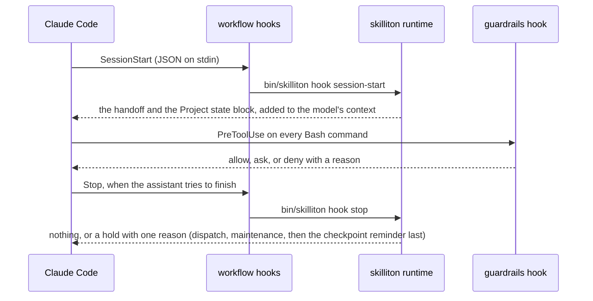

# Architecture: where the code is and how a session drives it

Kind: Living. For an engineer opening the code for the first time. The product's flow (fork, release, install) is [HOW-IT-WORKS.md](HOW-IT-WORKS.md); the names and formats every module agrees on are [CONTRACTS.md](CONTRACTS.md). This page is the map between them: which file does what, and the path a request takes.

## Read these three first

1. `packs/base/plugins/workflow/runtime/skilliton.mjs`, the command router: the list of commands, the exit codes, the top-level error handling. About 120 lines.
2. `packs/base/plugins/workflow/runtime/commands/gate.mjs` with `lib/gate.mjs`: the pattern every command follows, a thin command over an engine in `lib/`.
3. `packs/base/plugins/workflow/hooks/hooks.json`, then `runtime/commands/hook.mjs` and `runtime/lib/session-hooks.mjs`: how a Claude Code session drives the runtime.

## The four plugins

| Plugin | What it ships | Language |
|---|---|---|
| `workflow` | the `skilliton` command (`runtime/`), the lifecycle hooks, and the skills task, review, handoff, maintain, dispatch, security, release | Node for the runtime; Bash for the one hook that must start in well under a second |
| `guardrails` | the shell-command guard (`hooks/guard-bash.sh`), the write guards for lane worktrees and the managed instruction block, and the guardrails skill | Bash, and Node for the two write guards |
| `context-hygiene` | the read guard (`hooks/read-guard.mjs`), the session-start checklist, the optional status line | Node and Bash |
| `code-quality` | the split-a-file skill and its evaluation cases | skills only |

Each plugin is a folder under `packs/base/plugins/` with `.claude-plugin/plugin.json` (its version, bumped on every change), `hooks/hooks.json` if it has hooks, and `skills/<name>/SKILL.md`. `.claude-plugin/marketplace.json` at the repository root lists the four.

## The runtime

```
bin/skilliton                 Bash launcher: finds node, then runs runtime/skilliton.mjs
runtime/skilliton.mjs         router: GROUPS lists every command; exit 0 done, 1 attention, 2 refused, 3 failed
runtime/commands/<name>.mjs   one per command: parse arguments, call lib/, print; exports run(argv) and help
runtime/lib/*.mjs             engines: pure planning where possible, one writer per kind of file
```

**Every writing command previews first.** Without `--apply` a command prints what it would change and writes nothing; with `--apply` it prints the same plan and writes it. A refusal exits 2 and says "Nothing was written". This is the contract a reviewer can hold every command to, and `scripts/skilliton.test.mjs` snapshots folders to prove a preview wrote nothing.

**The engines, grouped by what they own:**

| Area | Modules | What they hold |
|---|---|---|
| Shared machinery | `core.mjs`, `config.mjs`, `ids.mjs` | refusals, argument parsing, backups and diffs; the `.skilliton/config.json` contract; the one ID rule for records |
| A project's setup | `prepare.mjs`, `project-files.mjs`, `harness.mjs`, `migrations.mjs`, `stack.mjs`, `auto-prepare.mjs` | adopting existing records and writing the missing ones in one transaction; the managed instruction block; ordered layout migrations with receipts and rollback; what a repository shows about itself |
| Everyday records | `tasks.mjs`, `records.mjs`, `handoff.mjs`, `journal.mjs` | task records and checkpoints; decision and lesson entries and their generated indexes; the handoff; the local journal of session events and git state |
| The session hooks | `session-hooks.mjs`, `lifecycle.mjs`, `maintain.mjs` | what the session-start, stop and prompt hooks decide and print; where a project stands; when maintenance is due |
| Checks and audit | `gate.mjs`, `audit.mjs`, `audit-run.mjs`, `audit-install.mjs`, `usage.mjs` | running a project's checks with the output kept in a log; the offline audit rules and where it runs; reading the meter per merged batch |
| Security evidence | `security.mjs`, `security-io.mjs`, `collectors.mjs` | fingerprinted evidence records that go stale when their sources change, applicability decisions, and the collectors |
| Releases and trust | `release.mjs`, `trust.mjs`, `verify.mjs`, `treehash.mjs`, `pin.mjs`, `join.mjs`, `fork.mjs`, `skills-repo.mjs` | manifests that hash every installable file, SSH-signed tags, the trusted signers, checking installs against a release, joining a machine, making a fork a company's own |
| The shared-branch gate | `delivery.mjs`, `delivery-policy.mjs`, `delivery-install.mjs`, `delivery-persist.mjs` | the pre-receive gate on a shared bare repository, the policy file, installing the hook |
| The machine | `preflight.mjs`, `doctor.mjs` | whether a machine lets Skilliton work, and whether an install is healthy |
| Before the rename | `legacy-names.mjs`, `legacy-template.mjs`, `prototype-v1.mjs` | the earlier product name and layouts, kept only so migrations can recognize and move them |

## The path of one session



1. **Session start.** `hooks.json` runs `session-start-handoff.sh` (the latest RESUME HERE, in Bash so it is fast) and `bin/skilliton hook session-start`. `commands/hook.mjs` reads the JSON the client sends, `lib/lifecycle.mjs` works out where the project stands, and `lib/session-hooks.mjs` prints the Project state block. On a joined machine an unprepared repository is prepared here (`lib/auto-prepare.mjs`); on any other it is offered in plain words.
2. **Every shell command.** `guardrails/hooks/guard-bash.sh` splits the command into segments and words, and denies, asks or allows. It reads its settings from the project's `.skilliton/config.json` and prints a notice when a rule is let through only because a setting turned it off.
3. **Every read.** `context-hygiene/hooks/read-guard.mjs` refuses a whole-file read of a non-image file over 50 KB.
4. **A prompt.** `bin/skilliton hook user-prompt-submit` counts the items in a prompt; at six or more it adds a note directing `/workflow:dispatch`.
5. **Stop.** `bin/skilliton hook stop` decides, in order, whether dispatch was skipped, whether maintenance is due, and whether the working tree changed with no checkpoint since. At most one hold per state, recorded in the journal so it is not repeated.

## Errors and exit codes

A command throws `Refused` (exit 2) for anything the user can fix, with a sentence saying how, or returns 1 when an evaluated state needs attention. An unexpected error is caught in the router and reported as exit 3 with "This is a bug in skilliton". `lib/lifecycle.mjs` `guardCommand` maps the engine error classes to those codes for the commands that use it.

## Tests and checks

Everything under `scripts/` is development tooling and never ships. `.github/workflows/checks.yml` is the one list of checks, and `node scripts/checks.mjs` runs that same list locally with one verdict line per step and the full output in a log. Most suites run the real command against real git in a temporary home; each checker has a `--self-test` or mutation case proving it can fail. The shape of the runtime is held by `scripts/lint.test.mjs` (a 600-line ceiling with pinned exceptions that may only shrink), `scripts/deadcode.mjs` and `scripts/inventory.mjs`.
