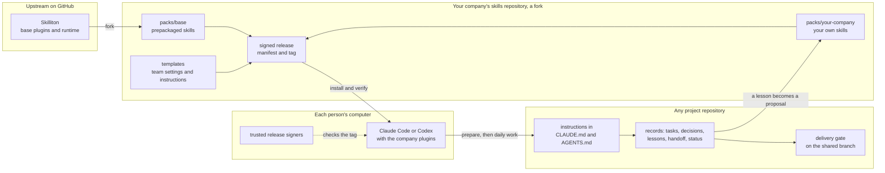
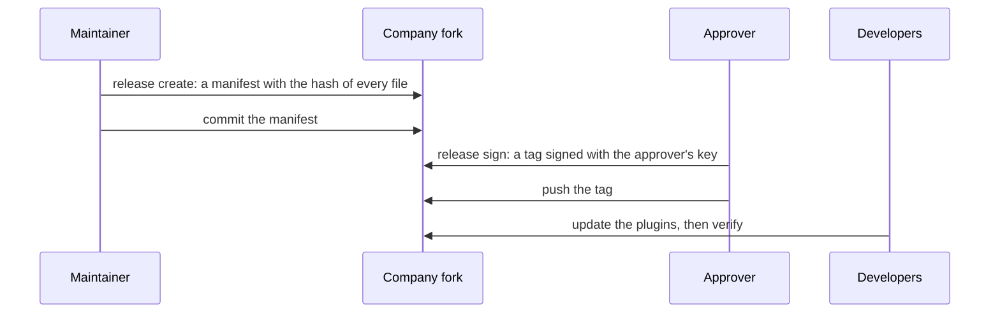
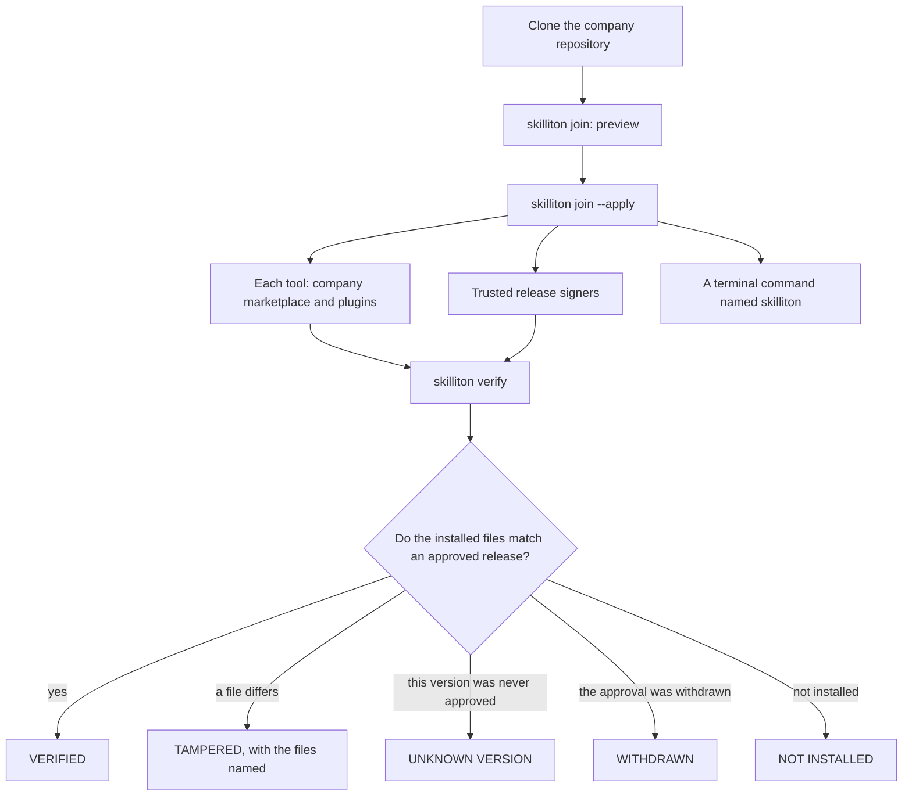
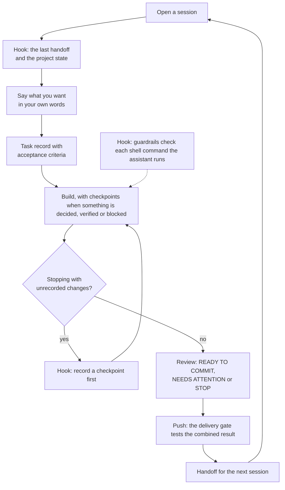
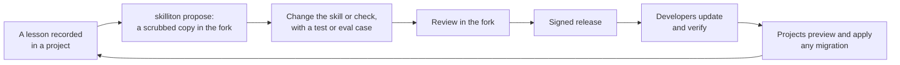

# How Skilliton works

Kind: Living. For anyone meeting Skilliton for the first time: a company lead deciding whether to use it, a reviewer, or a new builder. Updated 2026-09-16. Each step links to the run that proved it; the milestones are in [PLAN.md](../PLAN.md) section 7.

**Skilliton is a skeleton your company forks.** Your copy holds how your company builds software: its skills, checks, record keeping and security evidence. You release versions of it, every person's Claude Code or Codex installs that version, and the assistant then works the company's way in any repository they open. Lessons learned in projects come back to your copy as proposals, and nothing changes for developers until you release it.

## In one picture



## Three kinds of change, three routes

| What changes | How it reaches people | What protects it |
|---|---|---|
| Skills, hooks and the `skilliton` runtime | A signed company release, installed through the client's plugin marketplace | `skilliton verify` compares the installed files with the approved release |
| A project's instructions, settings and record layout | A versioned migration that each project previews, then applies | Backups, a receipt per migration, and rollback while the files are unchanged |
| The application's own code | Ordinary branches and review | The project's delivery gate tests the combined result before it reaches the shared branch |

## Step 1: Fork

Fork the repository on GitHub, or clone it into a private repository. This is what your company then owns:

```text
your-skills-repository/
  .claude-plugin/marketplace.json   the catalog people install from; its name is your marketplace
  packs/base/plugins/               prepackaged: workflow, guardrails, context-hygiene (leave unchanged)
  packs/<company>/plugins/          your own plugins and skills
  templates/project-settings.json   the settings every project of yours receives
  releases/                         release manifests; approval is a signed tag
  scripts/skilliton.mjs             the command line, run from this checkout
```

Leave `packs/base/` as it is, so upstream improvements merge cleanly. The one base file meant for editing is `packs/base/plugins/workflow/templates/harness.md`: the instructions every project's `CLAUDE.md` and `AGENTS.md` receive.

## Step 2: Make it yours

```bash
node scripts/skilliton.mjs company init --name <company> --marketplace-repo <owner>/<repo> --apply
node scripts/skilliton.mjs new-plugin <plugin> --pack <company> --apply
node scripts/skilliton.mjs new-skill <plugin> <skill> --pack <company> --description "<what it does and when to use it>"
```

- **`company init`** names your marketplace, sets its owner, and points the team settings template at your fork. Without it, projects would keep installing the upstream plugins instead of yours.
- **`new-plugin`** creates a plugin in your pack, lists it in the catalog so people can install it, and turns it on in the team settings.
- **`new-skill`** writes a skill skeleton for you to fill in. To bring in a skill you already have, use `node scripts/skilliton.mjs import <folder> --into <plugin> --pack <company>`, which first scans it for names, secrets and home paths.
- `company init` and `new-plugin` show their change and write nothing until you add `--apply`. `new-skill` creates the skill straight away.

Then keep, or leave out, what comes prepackaged:

| Plugin | What it gives every project | How it runs |
|---|---|---|
| **workflow** (required: it carries the `skilliton` runtime) | `task`: a plain request becomes a task record with acceptance criteria and checkpoints. `review`: what changed, what could break, what was tested, and a READY TO COMMIT, NEEDS ATTENTION or STOP verdict. `handoff` and `maintain`: a note for the next session, and records reconciled with git. `dispatch`: many items split into checked parallel lanes. `security`: evidence that goes stale when its sources change. `skilliton gate`: the project's checks as a verdict, with the output in a log | Skills are **instructed**: the assistant follows them. The session-start summary and the reminder to record a checkpoint are hooks, **enforced** on Claude Code |
| **guardrails** | Blocks force-pushes to protected branches, skipped git hooks and commits that look like they hold a secret; asks before commands that throw away uncommitted work | A hook, **enforced** on Claude Code for the commands the assistant runs |
| **context-hygiene** | A read guard that refuses a whole-file read of a non-image file over 50KB with the reason, a session-start checklist, and the rules for keeping the assistant's context small (ranges, batching, `skilliton gate` for checks, subagents) | The read guard is a hook, **enforced** on Claude Code for the Read tool; the rest is a skill, **instructed** |

Codex installs the same plugins and reads the instructions, but it does not run hooks that ship inside plugins (measured). On Codex, treat every enforced line as instructed unless your company configures Codex hooks itself. [CLIENTS.md](CLIENTS.md) has the details for each client.

Proof: [the fork rehearsal](../evidence/rehearsals/2026-09-16-fork/SUMMARY.md) renames a fork, adds a company plugin with a skill, passes strict plugin validation, and installs and verifies all four plugins from the renamed marketplace on Claude Code and on Codex.

## Step 3: Release



```bash
node scripts/skilliton.mjs release create --version 1.0.0 --apply
git add releases/1.0.0.json && git commit -m "Release 1.0.0"
node scripts/skilliton.mjs release sign 1.0.0 --apply
git push origin skilliton-release/1.0.0
```

Approval is the signed tag and nothing else. Each approver adds a line to an SSH `allowed_signers` file, which developers receive through a channel an attacker cannot also edit, not from the repository itself. A bad release is withdrawn with `release withdraw` and replaced by a new, signed one. [RELEASING.md](RELEASING.md) walks through each of these.

## Step 4: Install on every machine

Once per computer, from a clone of the company's repository:

```bash
git clone https://github.com/<owner>/<repo> ~/company-skills
node ~/company-skills/scripts/skilliton.mjs join --company <company> --signers <file from your company>           # preview
node ~/company-skills/scripts/skilliton.mjs join --company <company> --signers <file from your company> --apply   # set up
```

`join` sets up every coding tool it finds, Claude Code and Codex:

- it adds the company marketplace and installs the plugins the company's settings turn on;
- it trusts the company's release signers, from a file the company gives you separately, never from the repository;
- it puts a `skilliton` command in `~/.local/bin` for the terminal, and tells you when that folder is not on your PATH (it never edits your shell profile);
- it ends by running `skilliton verify` for each tool.

It shows everything first and writes nothing until `--apply`. What it adds is recorded, so `skilliton join --undo --company <company> --apply` takes exactly that back out and keeps whatever you had before. Each project then declares the company tools with `skilliton project-settings --dir <project> --apply`, which writes `.claude/settings.json` from your template; commit it.



## Step 5: Work in any codebase

**The first time in a repository**, preparation adopts what the project already has and adds only what is missing:

```bash
skilliton prepare --dir <project>          # preview
skilliton prepare --dir <project> --apply  # write
```

- It keeps existing status, backlog, decision, lesson and handoff files, and creates the missing ones marked "not yet assessed".
- It writes the team's instructions into `CLAUDE.md` and `AGENTS.md` between markers, leaving your own text alone, and sets up the security register.
- Running it again changes nothing, and `skilliton remove` takes Skilliton out again while keeping every record.
- Today a person or the assistant starts it; having the first session offer it is milestone M8.

**Every day after that:**



| In the picture | Kind | Where it holds |
|---|---|---|
| The session-start summary, the checkpoint reminder, guardrails | **enforced** by a hook | Claude Code (measured in live sessions); on Codex only if the company configures hooks |
| The task record, checkpoints, review and handoff | **instructed**: the assistant follows the instructions and skills | Claude Code and Codex |
| The delivery gate | **checked at merge** | The shared repository, whichever tool each person uses |

The commands underneath are ordinary and can be run by hand: `skilliton task start "<title>" --criteria "<done when>" --apply`, `skilliton checkpoint --state "<what is true>" --next "<next step>" --apply`, `skilliton record decision "<title>" --apply` and `skilliton status`. The delivery gate is installed once per shared repository with `skilliton delivery install` ([DELIVERY.md](DELIVERY.md)).

## Step 6: Improve and update



A proposal is not policy: it changes nothing until the company reviews it, tests it and releases it. A plugin update never edits a project. When a release changes the instructions or the record layout, each project previews `skilliton migrate` and applies it, with a backup and a receipt.

## What is proven and what is not

| What | State | Evidence |
|---|---|---|
| Fork, make it yours, release, install and verify on Claude Code and Codex | measured, installing from a local folder | [fork rehearsal](../evidence/rehearsals/2026-09-16-fork/SUMMARY.md) |
| Update, a tampered install, an unauthorized release, rollback, withdrawal, a migration and removal | measured, under the default marketplace name | [company release rehearsal](../evidence/rehearsals/2026-09-16-company-release/SUMMARY.md) |
| Preparing new and existing projects, two contributors, an interrupted session | measured offline | [project rehearsal](../evidence/rehearsals/2026-09-16-projects/SUMMARY.md) |
| Session start, checkpoint reminder and guardrails in real Claude Code sessions | measured, headless | [live sessions](../evidence/rehearsals/2026-09-16-live-clients/SUMMARY.md) |
| The delivery gate accepting a good change and rejecting a combined break | measured in tests and the demo | `node scripts/autopilot-demo.mjs` |
| One-command machine setup with `join`, and `join --undo`, on Claude Code and Codex, ending VERIFIED | measured, installing from a local folder | [machine rehearsal](../evidence/rehearsals/2026-09-17-machine/SUMMARY.md) |
| Installing from a GitHub source | measured on this public repository, on both tools; it has no signed release yet, so verify reports UNKNOWN VERSION | same rehearsal, step J8 |
| Company plugins arriving from device-managed settings, with no developer command | measured on a clean Linux container without a login: active from the third session start, or the first with a first-login install; macOS not yet run | [enrollment rehearsal](../evidence/rehearsals/2026-09-17-enrollment/SUMMARY.md) |
| Working alongside company endpoint security (application allowlisting, endpoint detection, inspecting proxies) | [IT-ALLOWLIST.md](IT-ALLOWLIST.md) is read from the code and held to it by a test; `skilliton preflight` checks a laptop before setup and is proved against blocks made on purpose; **not tested under any product** | B29 in [BACKLOG.md](BACKLOG.md) |
| Running on Windows | decided and built in theory (Git for Windows, one implementation of every hook); **no Windows machine has run anything** | [WINDOWS.md](WINDOWS.md), B30 |
| Lifecycle hooks on Codex | not observed | [CLIENTS.md](CLIENTS.md) |
| The GitHub delivery adapter on a hosted repository | documented, not proved | [DELIVERY.md](DELIVERY.md) |
| A real new builder following these docs | not started (M5) | [protocol](rehearsals/NEW_BUILDER.md) |
| Any cost or usage saving | not claimed | [DECISIONS.md](../DECISIONS.md) O2 |

Everything exercised so far, by platform and version, is in [COVERAGE.md](COVERAGE.md).

## Where to go next

- **Running the company's copy:** [RELEASING.md](RELEASING.md).
- **Joining a team that uses it:** [ONBOARDING.md](ONBOARDING.md).
- **Trying it in two minutes, with no account:** `node scripts/autopilot-demo.mjs`.
- **Every command and format:** [CONTRACTS.md](CONTRACTS.md).
- **What comes next:** Phase 3, the company-wide autopilot (device-management enrollment, routines while working, a security audit, more AI coding tools), explained in [PHASE-3.md](PHASE-3.md); milestones in [PLAN.md](../PLAN.md) section 7.
- **What is claimed, with its evidence, and the questions to expect:** [POSITIONING.md](POSITIONING.md).
