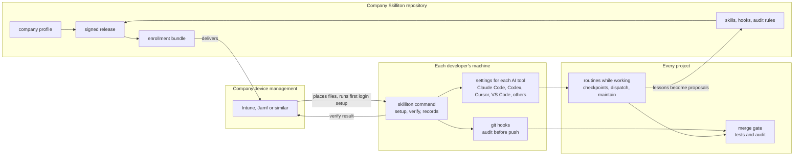

# Phase 3: company-wide autopilot

Kind: Living. For the owner and anyone judging where Skilliton goes next: a company lead, a reviewer, an interviewer. Written 2026-09-16 from the owner's Phase 3 direction. The milestones and their state live in [PLAN.md](../PLAN.md) section 7; this page explains them. Every tool behavior below is labelled **measured** (run here, with evidence), **documented** (the vendor's own documentation, linked in [Sources](#sources), not yet run here) or **unverified**.

## The idea in one paragraph

When a company hands someone a new laptop, device management (Windows Autopilot with Intune and Entra ID, or Jamf on a Mac) has already set it up: the right apps, the settings, the security policy, and a check that the laptop still complies. Nobody sets it up by hand. Phase 3 does the same for AI-assisted development. The company keeps one Skilliton package in its own repository. Its existing device management delivers that package to every developer's machine. From then on, whatever AI coding tool the person opens works the company's way, and the routine work runs by itself as they build: records kept current, a checkpoint before context is compacted, a suggestion to split large requests, and a security audit before code leaves the laptop and again at the merge. The person concentrates on what they are building. It is aimed especially at people who build with AI without large-team experience, who may never have been shown these practices (a belief checked below, not yet tested with a real user).

## Why this is buildable now

In 2026 the AI coding tools converged on a few shared formats, each documented by the vendors themselves (see [Tool support](#tool-support)):

- **Skills** as SKILL.md folders, the Agent Skills open standard. Codex, Cursor, VS Code with GitHub Copilot and Hermes Agent cite it, and Claude Code uses the same SKILL.md format.
- **Instruction files**: AGENTS.md, now stewarded by the Agentic AI Foundation under the Linux Foundation, plus CLAUDE.md. Skilliton already writes both.
- **Claude Code's plugin and hook files**, which VS Code, Cursor and xAI's Grok Build say they read.
- **An Agent Plugins open standard** (a root `plugin.json` with skills and MCP servers) that VS Code, Cursor and OpenAI document.
- **Company-managed settings files** that device management can place, for Claude Code, Codex, Cursor's hooks, VS Code, GitHub Copilot and Grok Build.

Shared formats do not by themselves give a company one approved package, delivered to every tool on every machine, verified, audited and kept current. That company layer is what Skilliton builds.

## Where Phase 3 starts

| Phase | Milestones | What it delivered | State |
|---|---|---|---|
| 1. Foundation | M0 to M5 | One prepared project, work that survives interruptions, signed company updates, security evidence, a merge gate | M1 and M4 verified locally, M2 on Claude Code, M3 at install level; M5 needs a real participant |
| 2. Make it yours | M6, M7 | A fork becomes the company's own in one command; one command sets up a machine on Claude Code and Codex | Verified locally |
| **3. Company-wide autopilot** | **M8 to M14** | One name; routines that run as people work; a security audit; enrollment through device management; any AI coding tool; proof of value | **Planned, none started** |

## The device-management model, mapped

Skilliton does not replace Intune, Jamf or Entra ID and does not talk to them. It produces the files and scripts a company's device management already knows how to deliver, and a result that device management can read back.

| On a company laptop | In Skilliton | Who does it |
|---|---|---|
| Autopilot deployment profile: what a new device gets | **Company profile**, one file in the company's Skilliton repository: tools to configure, plugins per team, routines on or off, audit level, release ring | The company's maintainers, reviewed like code |
| Entra ID groups: which devices get which profile | Plugin sets per group in the profile (for example backend, mobile); the device management tool targets its groups | Device management |
| Intune or Jamf apps and configuration profiles | **Enrollment bundle** built from a signed release: each tool's managed settings, the release signers, a first-login setup step, prerequisite checks | Skilliton builds it; device management delivers it |
| Enrollment Status Page: the device finishes setup before use | First login runs machine setup (`join`, M7) for the signed-in person without a command from them. Unlike the Enrollment Status Page, it does not hold the person back until it finishes | Skilliton, started by device management |
| Compliance policy: the device reports whether it still complies | A detection script runs `verify` and reports VERIFIED, TAMPERED, UNKNOWN VERSION or NOT INSTALLED as a device attribute | Skilliton reports; device management decides what to do |
| Update rings: pilot devices first | Release rings: a pilot group follows the newest signed release, everyone else stays pinned to the approved one | Skilliton releases; device management targets the rings |
| Retire a device | An offboarding script removes exactly what setup added (`join --undo`, M7) and the settings files | Skilliton builds it; device management runs it |

## How it fits together

## What "automatic" means, tool by tool

A plan that says "it runs automatically" has to say what runs it. There are four ways, from weakest to strongest:

| How it runs | What it can do | Where it exists |
|---|---|---|
| **Instructed**: the assistant is told to do it | Anything the assistant can do, when it follows the instruction | Every tool that reads an instruction file or skills |
| **Hook**: the tool runs a Skilliton command on an event | Show state at session start, add a note to a prompt, ask for a checkpoint before stopping, write a snapshot before compaction | Claude Code, Codex, Cursor, VS Code (preview), Grok Build and Hermes Agent document hooks, each able to block different things; see [Tool support](#tool-support). A hook cannot run a skill by itself: it can add context or refuse to stop, and the assistant then does the work (measured on Claude Code with the checkpoint) |
| **Git hook**: git runs it on commit or push | The deterministic audit and fast tests, whichever tool (or no tool) wrote the code | Any machine with git; a developer can skip it (`--no-verify`) |
| **Merge gate**: the shared repository runs it | Refuse a change that fails tests or the audit | The shared repository; the only layer a developer cannot switch off on their laptop |

The honest summary for a lead stays the same as in Phase 2: **guide on the laptop, enforce at the merge**. Phase 3 widens the guidance to more tools and adds the audit to both halves.

## The milestones

Size tags follow the planning rule used here: TRIVIAL, STANDARD, or FRONTIER (never done here before, so a throwaway spike comes before any estimate).

### M9: One name, Skilliton everywhere

**What changes.** Every current technical name becomes Skilliton (the security control IDs are the one owner decision, below): the `skilliton` command and its files, the default marketplace, the `.skilliton/` project folder, `SKILLITON_*` environment variables, the managed instruction markers, the machine setup receipt schema, the release tag prefix, the machine folders for trust, receipts, backups and the name denylist, and the GitHub delivery template. This supersedes the compatibility list in [BRANDING.md](BRANDING.md), on the owner's instruction of 2026-09-16.

**How existing setups move.**
- A prepared project moves with a numbered migration (preview, backup, rollback): the folder, the instruction markers, `.gitignore` entries and the team settings' marketplace keys. It refuses when both the old and the new folder exist.
- A machine set up with the old names moves when setup runs again: the receipt and trust files move, the old marketplace and plugins are replaced, and the old launcher is removed only when its text is exactly the old launcher (the rule from the join security review).
- Only the migration reads old names. If an old `SKILLGATE_*` variable is set, the command prints one line naming its replacement, because silently ignoring, for example, the trust folder variable would point verification at a different folder.
- Recorded evidence, signed manifests, completed task records and archived plans keep the names they were recorded with, because they describe what actually ran.

**Security control IDs stay as they are** (owner decision, 2026-09-16, O23). They start with `SG-` and stored observations refer to them; renaming them would mean rewriting evidence records, which must never look like a renewed assessment.

**Acceptance.** A test fails when an old name appears outside an allowlist of historical paths and the migration's table. Every offline suite passes. The fork, machine and company release rehearsals pass again on Claude Code and Codex under the new names. A project prepared with workflow 0.5.1 migrates and rolls back. A machine joined under the old names migrates, and its undo removes exactly what was added. An independent review pass runs before publishing, because trust and undo paths change.

**Size:** STANDARD. Roughly 1,700 occurrences in 179 tracked files, mostly mechanical, with trust, undo and migration code that needs care.

### M10: A security audit that runs itself

**What the person sees.** Risky code is pointed out in plain words while they work. Before a push, the changed files are audited (its running time is measured in acceptance). At the merge, the same audit runs again and a failing result blocks the change. Findings become backlog items with their evidence, and `skilliton audit` shows the open gaps at any time. It never says the code is secure.

**Build on what exists.** Anthropic's `security-guidance` plugin for Claude Code already reviews code at each edit (pattern match, no model call), at the end of each turn (a model review of the diff) and on each commit or push Claude makes (documented). OpenAI documents a Codex Security plugin (not yet read in detail here). Skilliton does not rebuild either; a company profile can turn them on. Skilliton adds the checks that stay the same whichever tool wrote the code, recorded as evidence:
1. The same **deterministic audit** in every tool, in a git hook and at the merge gate, whichever assistant wrote the code. Offline, no model call: secret-shaped values (the existing collector), dynamic code execution, shell commands built from strings, unsafe deserialization, disabled certificate checks, SQL built by string concatenation, debug modes and wildcard cross-origin access with credentials, risky CI workflow triggers and unpinned third-party actions, dependency manifests changed without a lockfile, tracked environment files. A company adds rules in its own pack.
2. **Recorded findings**: each becomes a scoped, expiring security observation mapped to the 15-control catalog and linked to a backlog item (the existing evidence system).
3. **Known scanners when present**: if gitleaks, semgrep or osv-scanner is installed, the audit runs it and records its version. Skilliton never installs them itself.
4. A **`security-audit` skill** for the judgment a pattern cannot make: a short threat review of the changed areas (who can reach this, what they could do, which control applies), recorded as observations that a person confirms.

**Acceptance.** Evals on a synthetic repository with planted flaws (a fake key-shaped value, injection, a missing authorization check, path traversal, a workflow injection) and clean look-alikes. Found, missed and false alarms are counted with and without the skill, and results are stated for those cases only. The git hook and the merge gate each block a planted flaw in a real push. A finding appears in the backlog with its evidence. The audit finishes within a stated time on this repository.

**Will not:** declare code secure or compliant, replace a penetration test, send code to an outside service, or install software.

**Size:** STANDARD for the deterministic audit, hooks and gate; FRONTIER for the model review's quality.

### M8 and M11: Routines that run as people work

M8 (already on the roadmap) covers the first minute in a new repository. M11 covers the rest of the day.

| Moment | Routine | How it runs on Claude Code |
|---|---|---|
| Opening a repository never prepared | Offer preparation in plain words, preview it, apply it on a yes, start the first task; draft a merge policy from the detected test commands for a person to confirm (M8) | SessionStart hook (measured event) |
| Opening any prepared repository | Show where things stand and the one next step (built) | SessionStart hook (measured) |
| A prompt with six or more separate items | Suggest splitting the work with dispatch before writing code | UserPromptSubmit hook adds a note (documented event, not yet run here) |
| Before context is compacted | Write a checkpoint snapshot (task, decisions, next step) so nothing is lost | PreCompact hook (event recorded today; the snapshot is new) |
| After compaction | Show the task and the snapshot again | SessionStart on compaction or PostCompact (documented, not yet run here) |
| Finishing with unrecorded changes | Ask for a checkpoint (built) | Stop hook (measured) |
| After a batch of merges or at the end of a day | Suggest maintain, then show the command | Stop hook or session start, instructed |
| Context growing large | The company profile may set the compaction window (`autoCompactWindow`, documented); whether a smaller window costs less is measured in M14 before anyone recommends it | Managed setting |

Other tools differ (documented): Cursor's stop hook cannot block, so the checkpoint request is instructed there; VS Code's hooks are in preview; Codex asks a person to trust each hook that an administrator did not set. Every routine ends its message with the one next thing to run, in plain words. Each can be turned off per project in `.skilliton/config.json`, and `status` shows which are on.

**Saving money is not claimed.** Compaction itself uses tokens and can force files to be read again, so it can cost more as well as less. The repository rule stands: no cost or savings statement without numbers from `scripts/token-cost.mjs`, cross-checked (M14).

**Acceptance.** Each routine observed in a live headless Claude Code session (the live-clients rehearsal, extended). M8's three repositories of different kinds. The same routines in each other tool where its hooks allow (M13), and stated as instructed where they do not.

**Size:** STANDARD on Claude Code; FRONTIER for other tools.

### M12: Enrollment, the company autopilot package

**What the company does.** It writes a company profile, releases, then runs `skilliton enroll build` (planned) to get a versioned enrollment bundle, and loads the bundle into its device management.

**What the bundle holds.**
- **Claude Code:** a drop-in file for `managed-settings.d/` that registers the company marketplace with auto-update and turns on the company plugins, optionally restricting other marketplaces (`strictKnownMarketplaces`). The same content as a macOS configuration profile (`com.anthropic.claudecode`) and a Windows registry value. The drop-in is used by default, so Skilliton never owns the company's whole Claude Code policy (all documented).
- **Codex:** `requirements.toml` (enforced; can restrict marketplace sources and allow only administrator hooks, which then need no per-person trust), `managed_config.toml` defaults, the administrator skills folder, and the macOS profile form (all documented). Codex hooks set this way are the likely route past the per-hook trust step measured in Phase 1.
- **The other tools:** their company-managed files, per [Tool support](#tool-support).
- **The release signers file.** Device management is the out-of-band channel machine setup already requires, so a pull can never change whom a machine trusts.
- **Scripts** for Intune (PowerShell on Windows, shell on macOS) and Jamf: check git and Node, place the files, register the first-login setup for each person, a detection script that reports the `verify` result, and an offboarding script. Intune documents running scripts as SYSTEM or root and, with remediations, re-checking and repairing on a schedule; Jamf runs scripts from policies and sets preference domains.
- **Rings:** the pilot ring follows the newest signed release; the broad ring is pinned to an approved commit (Claude Code documents `ref` and `sha` pins; B18 measures it).

**Riskiest assumption, tested first.** Claude Code documents that managed settings register the company marketplace and can force plugins on. It also says whether a named plugin actually installs "depends on the plugin's source and which file enables it", and that a plugin from a GitHub source enabled in project settings stays not installed until each person installs it. This repository has never observed either path on a clean machine (O8 is the same gap for project settings). The first spike therefore places a drop-in on a clean Linux container (Docker and Colima are available here) and a clean macOS user account, and measures whether the company plugins install with no developer command, and with which gaps. If they do not, first-login setup (`join`) does the install, and the settings file keeps the plugins enabled and the marketplace allowed.

**Acceptance.** On clean machines, with files placed where and as device management places them: the first login ends VERIFIED on each configured tool with no developer command; a tampered file makes the detection script report TAMPERED; offboarding leaves nothing Skilliton added; a pinned ring does not follow a newer release. A real Intune or Jamf tenant needs the owner's access and is recorded separately.

**Will not:** enroll devices, manage identity, or stop a local administrator from editing managed files (Claude Code documents this limit). The merge gate remains the enforcement.

**Size:** FRONTIER.

### M13: Any AI coding tool

**The portable core** works whatever tool a person uses: skills in the SKILL.md format, the instruction block in each file a tool reads, the git hooks, the merge gate and the `skilliton` command.

**Adapters** translate the rest for each tool: where skills are installed, which instruction file is read, how hooks are declared, and how a company manages the tool's settings. Claude Code and Codex are measured today. The owner sets the order of the rest (O24), starting with a tool that documents reading Claude Code's files, so the first adapter is mostly a measurement.

A tool with no hooks still gets the instruction block, the skills, the git hooks and the merge gate, and Skilliton says plainly that its routines are instructed there.

**Design option, measured before adopted:** a local Skilliton MCP server that exposes status, checkpoint, task and audit as tools, for assistants that support MCP but not shell hooks. It would run over stdio only, apply the same refusals as the command line, and preview by default.

**Acceptance per tool.** A column in [CLIENTS.md](CLIENTS.md) with measured rows: skills visible to the assistant, the instruction block read, each hook that fires, and verify reading the install state. A rehearsal per tool before any document says the tool is supported.

**Size:** STANDARD per tool with documented skills and hooks; FRONTIER otherwise.

### M14: Proof of value, and the team view

- **A measured comparison** (was B16): the same small set of real tasks with the plain tool and with Skilliton. It records tokens and cost (`scripts/token-cost.mjs`, cross-checked against Claude Code's documented usage metrics `claude_code.token.usage` and `claude_code.cost.usage`), time, how often a person stepped in, rework, planted security flaws caught before merge, and resume accuracy after an interruption.
- **A read-only team view** (was B15), generated locally: who is working on what, what is blocked, which machines are not VERIFIED, stale security evidence, open audit findings, proposals waiting for review.
- **Rule:** time, cost and quality statements come only from these numbers, stated for exactly what was measured.

**Size:** STANDARD; the paid runs need the owner's approval and a spending ceiling.

## Order, and the demonstration on about 2026-09-23

The demonstration shows only what has passed its acceptance checks by that day. The rest is presented as the plan, with this page.

| Order | Work | Why this order |
|---|---|---|
| 1 | M9 rename | The owner's instruction; every later file and demo uses the final names |
| 2 | M12 spike: a Claude Code drop-in on a clean container and a clean macOS account | Tests the riskiest assumption while changing course is still cheap |
| 3 | M10 deterministic audit, git hook, merge gate check, Claude Code stop routine | The most visible value, built on existing evidence code |
| 4 | M11 compaction snapshot and dispatch suggestion on Claude Code | Small, and shows routines running by themselves |
| 5 | M13 spike: Cursor, running a Grok model, reads the same plugin, skills and instruction block | The owner chose Grok and uses it through a Cursor account (O24). Cursor documents reading Claude Code's skills and hook files, and its terminal agent is on this machine. Grok Build follows with checks that need no login, since its live sessions need a SuperGrok or X Premium Plus subscription |
| 6 | B14 demonstration script covering what passed in 1 to 5 | Nothing unproven is shown |
| After | M12 bundle and rings, M13 further tools, M14, M8's three repositories, M5 | Each needs the spikes above, owner access, or paid runs |

## Belief check

What the owner described, checked against what can be built and proven. None of it is false as a direction; the corrections are about scope and proof, written down here before the demonstration.

| Belief | Check | Correction or proof needed |
|---|---|---|
| A company can push its Skilliton package to every device the way Intune pushes a laptop setup | **TRUE for delivery** (documented for Claude Code: managed settings files, macOS profiles, Windows registry, with Jamf and Intune templates) | Skilliton builds the bundle; the company's device management delivers it. Measured in M12 |
| It works in Claude Code, Codex, Grok, VS Code, Hermes, Cursor and similar tools | **Measured for Claude Code and Codex; documented for the rest**: skills and AGENTS.md in all six; Claude Code's plugin and hook files read by VS Code, Cursor and Grok Build; company-managed files for all but Hermes on macOS and Windows | Each tool is supported only after its CLIENTS.md column is measured (M13). Where a tool's hooks cannot do a routine, that routine is an instruction there |
| Routine work runs by itself as people develop | **TRUE where hooks exist, with a limit**: a hook can show, remind, refuse to stop or add a note, and the assistant does the work | Stated per tool; the merge gate is the only layer a developer cannot switch off |
| Automatic compaction saves money | **UNVERIFIED**, and may be false for some work | Measured in M14 before any statement |
| A security skill audits for gaps automatically | **TRUE for defined checks**, not for "all gaps" | Stated as what the audit checks; never "secure" |
| It runs dispatch when needed and explains what to run next | **TRUE on Claude Code as a suggestion**: documented prompt hook, not yet run here | Measured in M11 |
| People who build with AI but lack team experience are missing this step | **UNVERIFIED** (no user outside the author yet) | M5 participant; the demonstration audience |

## What Phase 3 will not do

- Run or replace device management, enroll devices, or manage identities. The company's own tools do that.
- Prevent a person with administrator rights from changing their own machine. The merge gate is the enforcement.
- Certify security or compliance, or run penetration tests.
- Promise time or cost savings before M14 measures them.
- Offer a hosted service or dashboard; the team view is generated locally (PLAN.md section 9).
- Claim a tool is supported before its measured CLIENTS.md column exists.

Checked as a set: with every exclusion applied at once, a company still gets one consistently configured way of working on every machine, routines in each tool where they are possible, and an audit and merge gate that hold whichever tool is used. The product still does its job without any of the excluded items.

## Kill criteria

Phase 3 changes course if any of these is measured:
- Managed settings cannot keep the company plugins installed and enabled on a clean machine, and first-login setup cannot run without the person's interaction on either macOS or Windows. Enrollment then becomes a documented one-command step, not an autopilot.
- The deterministic audit's false alarms exceed a limit written into the M10 task record before the evals run, on this repository's history or the synthetic evals. It then runs at the merge gate only, until the rules are tuned.
- A tool offers no instruction file, skills or managed configuration. It is then listed as not supported rather than half-supported.

## Tool support

What each tool's own documentation says, retrieved 2026-09-16, next to what has been measured here. "Reads Claude Code files" means the vendor documents reading Claude Code's plugin, skill or hook files without conversion. None of the documented cells is measured yet; M13 measures them.

| Tool | Skills (SKILL.md) | Instructions | Hooks | Reads Claude Code files | Company-managed delivery | Here |
|---|---|---|---|---|---|---|
| **Claude Code** | yes | CLAUDE.md | 28 events; SessionStart, PreToolUse, Stop and PreCompact used by Skilliton | not applicable | Managed settings file with a drop-in folder, macOS profile, Windows registry; server-managed settings on Teams and Enterprise | **Measured** (2.1.273): plugins, skills, hooks, verify |
| **Codex** (CLI; the IDE extension has no plugins) | yes, `.agents/skills` and an administrator folder | AGENTS.md | SessionStart, UserPromptSubmit, PreToolUse, Stop, PreCompact, PostCompact and more; non-administrator hooks need per-hash trust; plugin hooks now documented | reads `.claude-plugin/marketplace.json` | `requirements.toml` (enforced), `managed_config.toml`, macOS profile, cloud-managed for ChatGPT workspaces | **Measured** (0.154.0-alpha.6.2): plugins, skills, AGENTS.md, verify. That version reported plugin hooks removed; current docs say they load after trust, so this is re-measured |
| **Cursor** | yes, `.cursor/skills`, `.agents/skills`, `.claude/skills` | AGENTS.md, `.cursor/rules`, Team Rules | sessionStart, beforeSubmitPrompt, preToolUse, beforeShellExecution, preCompact, stop (cannot block); fails open unless `failClosed` | skills and `.claude/settings.json` hooks | Enterprise hooks file at a system path (device management); team marketplace plugins set to Required (Teams and Enterprise dashboard); a small MDM policy set | documented only; terminal agent 2026.02.13 installed |
| **VS Code with GitHub Copilot** | yes, `.github/skills`, `.agents/skills`, `.claude/skills` | AGENTS.md, CLAUDE.md, `.github/copilot-instructions.md` | preview: SessionStart, UserPromptSubmit, PreToolUse, PostToolUse, PreCompact, Stop and subagent events; ignores matchers on plugin hooks | `.claude-plugin/plugin.json`, `.claude/settings.json` hooks, `.claude/skills` | VS Code policies by Group Policy, macOS profile or policy file (extra and strict marketplaces, enabled plugins, managed hooks only); GitHub Copilot `managed-settings.json` by MDM | documented only; VS Code 1.138.0 installed |
| **Grok Build** (xAI's official `grok` command) | yes, `.grok/skills`, `~/.agents/skills`, plugin skills | AGENTS.md, CLAUDE.md, `.claude/rules/` | project and personal hook files; only PreToolUse blocks | "fully compatible with Claude Code": marketplaces, plugins, skills, MCP servers, agents, hooks | `/etc/grok/requirements.toml` recommended for device management; reads part of Claude Code's managed settings | documented only; needs a SuperGrok or X Premium Plus subscription |
| **Hermes Agent** (Nous Research; a general agent, not coding only) | yes, `~/.hermes/skills`, `.agents/skills` | first of `.hermes.md`, AGENTS.md, CLAUDE.md, `.cursorrules` | shell hooks with first-use consent; `pre_tool_call` blocks | hook output format only | `/etc/hermes` managed scope, Linux first; macOS, Windows and device-management delivery out of scope in its version 1 | documented only |

Also documented, for later adapters: **Gemini CLI** (skills in `.agents/skills`, hooks, extensions, system settings files; AGENTS.md needs a setting), **OpenCode** (skills including `.claude/skills`, AGENTS.md, hooks through code plugins, managed config including a macOS profile), **Devin Desktop, formerly Windsurf** (skills including `.claude/skills`, AGENTS.md, system hook files documented for Jamf and Intune), **JetBrains Junie** (skills in `.agents/skills`, AGENTS.md, hooks) and **Cline** (skills including `.claude/skills`, AGENTS.md, hooks through SDK plugins, a hosted console). A community `grok-cli` project is unrelated to xAI and installs a command with the same name.

**What this means for the design.**
1. **Package once, in two manifests.** Each Skilliton plugin keeps its Claude Code manifest, read by Claude Code, VS Code, Cursor and Grok Build, and gains an Agent Plugins manifest for skills and MCP servers, read by VS Code, Cursor and Codex. Skills also install into `.agents/skills` for tools without plugins.
2. **Hooks are per tool, and must fail safe.** Blocking power differs (Cursor's stop cannot block; only PreToolUse blocks in Grok Build) and VS Code runs plugin hooks on every event whatever the matcher. Every hook script therefore checks which tool and event called it, and does nothing harmful on input it does not expect.
3. **Company delivery is per tool, and nearly all of it is a file device management can place.** The enrollment bundle (M12) holds one file per configured tool. Cursor's Required plugins and Claude Code's server-managed settings are dashboard settings instead, documented as steps for an administrator.
4. **Hermes Agent on macOS and Windows** gets skills, instructions, git hooks and the merge gate, but no managed settings, until Hermes supports them there.

## Owner inputs

| Input | Needed for | Smallest version |
|---|---|---|
| Control ID prefix | M9 | Decided 2026-09-16: keep `SG-` (O23) |
| Tool order and accounts | M13 | Decided 2026-09-16: Grok, used through a Cursor account, so Cursor with a Grok model first, then Grok Build without login (O24). A Cursor login on this machine is needed for live sessions |
| Access to an Intune or Jamf test tenant, or a spare device | M12 on real device management | Optional; clean containers and accounts cover the files and scripts |
| A spending ceiling for the comparison runs | M14 | A number |
| Existing items | M3, M5, M7 | B2, B3, B4, B6, B7 and B1 in [BACKLOG.md](BACKLOG.md) |

## Sources

Retrieved 2026-09-16.

- Claude Code managed settings (file paths, `managed-settings.d/`, macOS profile domain, Windows registry, Jamf and Intune templates, administrator limits): https://code.claude.com/docs/en/managed-settings
- Claude Code server-managed settings (Teams and Enterprise): https://code.claude.com/docs/en/server-managed-settings
- Plugin marketplaces (`strictKnownMarketplaces`, `ref` and `sha` pins, background update authentication): https://code.claude.com/docs/en/plugin-marketplaces
- Settings reference (`extraKnownMarketplaces`, `enabledPlugins` and when a named plugin installs): https://code.claude.com/docs/en/settings-reference
- Plugin auto-update for organization marketplaces (`autoUpdate` in managed settings): https://code.claude.com/docs/en/discover-plugins
- Hook events: https://code.claude.com/docs/en/hooks
- Compaction window (`autoCompactWindow`, `CLAUDE_CODE_AUTO_COMPACT_WINDOW`): https://code.claude.com/docs/en/model-config
- Usage metrics (`claude_code.token.usage`, `claude_code.cost.usage`, compaction events): https://code.claude.com/docs/en/monitoring-usage
- The `security-guidance` plugin: https://code.claude.com/docs/en/security-guidance
- Plugins in the VS Code extension: https://code.claude.com/docs/en/vs-code
- Codex: skills https://learn.chatgpt.com/docs/build-skills ; plugins https://learn.chatgpt.com/docs/plugins ; hooks https://learn.chatgpt.com/docs/hooks ; managed configuration https://learn.chatgpt.com/docs/enterprise/managed-configuration ; configuration reference https://learn.chatgpt.com/docs/config-file/config-reference ; AGENTS.md https://learn.chatgpt.com/docs/agent-configuration/agents-md ; Agent Plugins manifest https://developers.openai.com/plugins/build/plugins
- Cursor: skills https://cursor.com/docs/context/skills ; rules https://cursor.com/docs/context/rules ; hooks https://cursor.com/docs/hooks ; Claude Code hooks https://cursor.com/docs/reference/third-party-hooks ; plugins https://cursor.com/docs/plugins ; deployment https://cursor.com/docs/enterprise/deployment-patterns
- VS Code: skills https://code.visualstudio.com/docs/copilot/customization/agent-skills ; instructions https://code.visualstudio.com/docs/copilot/customization/custom-instructions ; hooks https://code.visualstudio.com/docs/copilot/customization/hooks ; plugins https://code.visualstudio.com/docs/copilot/customization/agent-plugins ; policies https://code.visualstudio.com/docs/enterprise/policies
- GitHub Copilot managed settings: https://docs.github.com/en/copilot/reference/enterprise-administrators/enterprise-managed-settings
- Grok Build: skills, plugins and Claude Code compatibility https://docs.x.ai/build/features/skills-plugins-marketplaces ; hooks https://docs.x.ai/build/features/hooks ; enterprise https://docs.x.ai/build/enterprise ; announcement https://x.ai/news/grok-build-cli
- Hermes Agent: skills https://hermes-agent.nousresearch.com/docs/user-guide/features/skills ; managed scope https://hermes-agent.nousresearch.com/docs/user-guide/managed-scope ; hooks https://hermes-agent.nousresearch.com/docs/user-guide/features/hooks ; context files https://hermes-agent.nousresearch.com/docs/user-guide/features/context-files
- Agent Skills standard: https://agentskills.io/specification ; AGENTS.md: https://agents.md/
- Others: Gemini CLI https://geminicli.com/docs/cli/skills/ ; OpenCode https://opencode.ai/docs/config/ ; Devin Desktop hooks https://docs.devin.ai/desktop/cascade/hooks ; Junie https://junie.jetbrains.com/docs/agent-skills.html ; Cline https://docs.cline.bot/customization/skills.md
- Device management: Windows Autopilot https://learn.microsoft.com/en-us/autopilot/overview ; Intune shell scripts on macOS https://learn.microsoft.com/en-us/intune/device-management/tools/run-shell-scripts-macos ; Intune PowerShell scripts https://learn.microsoft.com/en-us/intune/device-management/tools/run-powershell-scripts-windows ; Intune remediations https://learn.microsoft.com/en-us/intune/device-management/tools/deploy-remediations ; Intune macOS preference files https://learn.microsoft.com/en-us/intune/device-configuration/templates/configure-preference-file-macos ; Jamf custom settings https://developer.jamf.com/jamf-pro/docs/application-custom-settings
