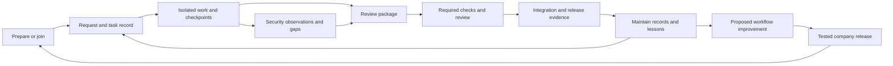

# Development harness implementation plan (archived)

Kind: Reference. Archived from foundation commit `23aae41`. Preserved for implementation history and original usage notes. [Current PLAN.md](../../../PLAN.md) and [integration brief](../../AUTOPILOT_INTEGRATION.md) supersede its roadmap and branch-status statements. No branch checkout is needed: the scripts are now in the main working tree.

Kind: Reference.

Status: first local increment implemented and locally verified, awaiting integration. Product direction requested 2026-09-16. Extends PLAN.md without closing its earlier live-install, release, or usage gates. Commands and integration handoff: `docs/AUTOPILOT_HANDOFF.md`. Verification: `evidence/autopilot-foundation/verification.md`.

## Outcome and ownership

A person joins a prepared repository, works from a plain-language request, preserves decisions across sessions, and submits a reviewable change through the team's checks. Security records are part of the base setup and normal maintenance.

This lane owns new preparation and evidence scripts, their tests, and this plan on `codex/autopilot-foundation-0916`. The main checkout's active onboarding, guardrails, and CI work belongs to the existing build sessions. Integrate through their CLI rather than replacing it. No writes to global settings, credential stores, unrelated repositories, hosted rules, or production systems in this increment.

## Architecture

| Component | Responsibility | Authority |
|---|---|---|
| Prepare | Adopt existing records, fill gaps, install portable runtime and bounded instruction pointers | Explicit target repository and versioned config |
| Workflow skills | Interpret requests, organize work, preserve decisions, review evidence | Instructions guide the assistant; execution is not guaranteed |
| Project records | Status, backlog, roadmap, decisions, lessons, task handoffs | Versioned files; task records precede generated views |
| Security evidence | Record scoped observations and expose missing, stale, invalid evidence | Append-only records bound to sources, artifacts, and catalog |
| Shared validation | Check proposed changes and combined merge results | Trusted CI and host rules, configured separately |
| Company releases | Review and distribute improved workflows | Company-approved versions; upstream changes are proposals |

## Milestones

| ID | Increment | Acceptance gate | State |
|---|---|---|---|
| A1 | Repository preparation | Dry-run changes nothing; repeated apply preserves content; existing conventions adopted; unsafe paths refused; disposable-repo walkthrough | Locally verified |
| A2 | Security foundation | Nonempty versioned baseline; observations remain claims; source/artifact/mapping changes become stale; invalid inputs fail; status cannot re-stamp | Locally verified |
| A3 | Normal-work integration | Main onboarding calls Prepare; Maintain/Review consume reports; hooks exercised in each supported client | Planned |
| A4 | Concurrent records | Task handoffs and separate decision/lesson entries; collision-resistant IDs; generated views; two-branch reconciliation loses no work | Planned |
| A5 | Shared merge checks | Good and defective PRs exercise required checks; latest combined tree tested; policy changes separately reviewed | Planned |
| A6 | Framework coverage | Licensed versioned catalog import; approved applicability; mapping rationale; gaps linked to backlog; scoped assessment packet | Planned |
| A7 | Fleet updates | Second machine joins, receives approved update, preserves project content, and proves removal/rollback | Planned |
| A8 | User rehearsal | Beginner completes a task, resumes after interruption, hands off, and sees defective work blocked; effort measured | Planned |

A1/A2 are locally verified. Integrate A3 with the main CLI owner next. A5 reuses repository-host facilities. A7 coordinates with existing release/verify work and native plugin distribution. No calendar commitment is inferred for the expanded roadmap.

## Preparation contract

- Project preparation is a repository change. Workstation joining verifies what is already defined; it never resets shared documents.
- Require a named Git repository root. Default is dry-run; `--apply` writes; `--check` reads only.
- Adopt configured or discoverable STATUS, BACKLOG, ROADMAP, DECISIONS, LESSONS, HANDOFF, and MAINTAIN documents. Fill missing structures with unassessed state, not invented facts or commitments.
- Add managed instruction blocks to CLAUDE.md and AGENTS.md. Preserve surrounding content and established file names.
- Back up modified config/instructions in Git-private metadata, preserve unrelated keys, and make reapply a no-op. Refuse malformed config, ambiguous markers, symlinks, traversal, and incompatible setup versions. Caught write failures attempt rollback while preserving intervening edits. A terminated process can leave partial setup and a lock; inspect before recovery.
- Include security records from setup. The first catalog is an explicitly partial development-practice baseline, not complete ASVS/ISO coverage.
- Copy the small runtime into the prepared repo so moving the toolkit does not break it. Upgrades are explicit versioned changes.

## Security model

Applicability, mapping, implementation, verification, and freshness are distinct. A framework reference relates a local practice to a requirement; it is not an equivalence assertion or certification.

The first engine stores immutable observations with unique ID, catalog/control identity, timestamp, reviewer label, assessment, explanatory note, and SHA-256 fingerprints of source and redacted evidence files. It derives current/stale/missing/invalid status without changing the original observation. `observed` is a recorded assessment, not a verified control pass. Complete current observations are not a compliance result.

A3 adds normal-work triggers: task checkpoint, pre-review, Maintain, and shared validation. A6 adds bounded collectors, approved applicability, protected external evidence references, expiry, environment/tool identity, and deduplicated backlog findings. Missing tooling and organizational evidence stay visibly unassessed.

Initial freshness covers only explicitly recorded files and the catalog/control definition. It cannot detect a forgotten dependency, a newly added unrecorded file, remote configuration changes, or whether a review was good. Directory manifests, dependency graphs, collectors, and expiry are A6 work. The first report states this limitation.

## Framework sources and scope

Verified 2026-09-16:

- OWASP ASVS 5.0.0 is the stable application-security catalog. Pin `v5.0.0_release`; retain attribution and CC BY-SA 4.0 terms when distributing its material. Do not import the moving latest/bleeding-edge asset. https://github.com/OWASP/ASVS/releases/tag/v5.0.0_release
- NIST SSDF 1.1 / SP 800-218 remains final. SSDF 1.2 / SP 800-218 Rev. 1 is an initial public draft. Use 1.1 as the baseline. https://csrc.nist.gov/pubs/sp/800/218/final and https://csrc.nist.gov/pubs/sp/800/218/r1/ipd
- ISO/IEC 27001:2022 with Amendment 1:2024 and ISO/IEC 27002:2022 address organizational requirements/control guidance. Begin with references; distribution and model ingestion of restricted text need permission covering that use. This is a rights constraint to resolve, not removal from the roadmap. https://www.iso.org/standard/27001 and https://www.iso.org/standard/75652.html and https://www.iso.org/copyright.html
- OWASP WSTG 4.2 supplies versioned assessment references. A testing packet specifies authorized targets, methods, accounts, exclusions, stop conditions, and evidence handling. Preparing it does not authorize active testing. https://github.com/OWASP/wstg and https://csrc.nist.gov/pubs/sp/800/115/final

## Review and learning

Each change arrives with its request, acceptance evidence, changed behavior, relevant decisions, security gaps, and remaining-review list. Shared checks cover repeatable conditions. Human review focuses on intent, consequential architecture, authorization, data changes, and validation policy. A contribution cannot approve its own weakening of required checks.

Start with human approval for code changes. Introduce narrowly scoped faster paths only when measured outcomes support them. Compare native-tool and harness runs for task completion time, interventions, missed requirements, integration repairs, reviewer effort, and restart accuracy. No savings claim precedes measurement.

Capture local lessons during ordinary work. Promote a lesson into company policy only through an evidence-backed proposal, regression scenario, review, and release. Keep source-specific details private; do not copy personal or client material into the public base.

## First-increment tests, written before implementation

Prepare: clean repo, dry-run, repeated apply after human edits, existing document adoption, config preservation, malformed config/markers, path/symlink refusal, missing runtime, concurrent invocation. Run copied runtime from the prepared repo.

Evidence: current observation; source, artifact, and catalog drift; missing/empty catalog; malformed record; no re-stamp; dry-run; concurrent independent record files; unsafe paths and sensitive-input refusal without value echoes.

## Open integration seams

- Existing CLI owner routes Prepare/security commands to these implementations.
- Company defines framework applicability, evidence retention, external record access, and trusted policy ownership.
- Host administrator configures required merge/deploy rules; local instruction files are not enforcement.
- Real supported-client sessions must prove lifecycle triggering and recovery. Fixture success does not establish that proof.
